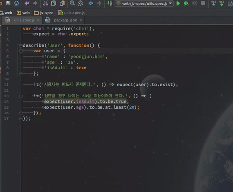

# Intellij에서 js 테스트하기(mocha)


## Installation

1. node.js 설치

2. NodeJs 플러그인 설치(Intellij Plugin)

3. mocha 모듈 설치

   ```shell
   $ npm install mocha
   ```

4. 자동완성 적용

   ***Settings / Preferences Dialog*** (`⌘,`) - ***Languages & Frameworks*** - ***JavaScript*** - ***Libraries*** 에서 lib 추가

   ​

> Intellij의 아래 메뉴에서도 모듈 설치 가능
>
>  ***Settings / Preferences Dialog*** (`⌘,`) - ***Languages & Frameworks*** - ***Node.js and NPM***


## Getting Started

- package.json 추가: `npm init`

  ```json
  {
    // ...
    "scripts": {
      "test": "mocha 'web/js-spec/**/*.js'"
    },
    // ...
  } 
  ```

  > *TODO*: 반드시 필요한 코드인가 확인

- Test 코드 작성

  ```javascript
  var chai = require('chai'),
  	expect = chai.expect;

  describe('User', function() {
  	var user = {
  		'name' : 'yeongjun.kim',
  		'age' : '26',
  		'isAdult' : true
  	};

  	it('사용자는 반드시 존재한다.', () => expect(user).to.exist);

  	it('성인일 경우 나이는 20살 이상이어야 한다.', () => {
  		expect(user.isAdult).to.be.true;
  		expect(user.age).to.be.at.least(20);
  	});
  });
  ```

- Run

  


## 참고

- [Preparing to Use Mocha Test Framework](https://www.jetbrains.com/help/idea/2016.2/preparing-to-use-mocha-test-framework.html?search=mocha)
- [Running Mocha Unit Tests](https://www.jetbrains.com/help/idea/2016.2/running-mocha-unit-tests.html?search=mocha)
- [Run/Debug Configuration: Mocha](https://www.jetbrains.com/help/idea/2016.2/run-debug-configuration-mocha.html?search=mocha)