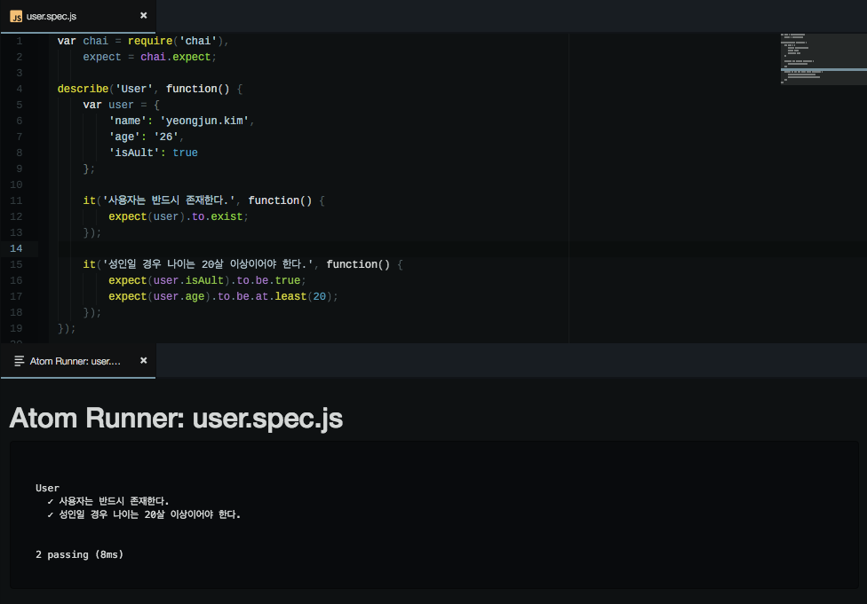

# javascript unit test 적용하기

**BDD란?**

행위 기반 테스트


## Requirements

[Mocha](http://mochajs.org/): JavaScript test framework

[chai](http://chaijs.com/): assertion library


## Installation

```shell
$ sudo npm install --global mocha chai # global
$ npm install mocha chai --save-dev # local
$ mkdir js-test
$ cd js-test
$ npm init
```


## Getting Started

**테스트 파일 생성**

```shell
$ mkdir test # mocha는 기본적으로 test 디렉토리 안에 있는 파일을 테스트함
$ vi test.js
```

```javascript
var assert = require('chai').assert;

describe('Array', function() {
    describe('#indexOf()', function() {
        it('should return -1 when value is not present', function() {
            assert.equal(-1, [1, 2, 3].indexOf(4));
        });
    });
});

describe('Test', function() {
    it('Assert api test using chai', function() {
        var foo = 'str';
        assert.typeOf(foo, 'string');
        assert.lengthOf(foo, 3);
    });
});
```


**Run Test Case** 

*case 1*

```shell
$ mocha
```

*case 2*

```shell
$ vi package.json
...
"script": {
  "test": "mocha"
}
...
$ npm test
```


**실행 결과**

```shell

  Array
    #indexOf()
      ✓ should return -1 when value is not present

  Test
    ✓ Assert api test using chai


  2 passing (10ms)
  
```


## Setting test(spec) directory

- 작명패턴으로 test 파일 찾기
- 디렉토리 설정으로 test 파일 찾기

```json
// package.json
{
  ...
  "scripts": {
    "test": "mocha 'spec/**/*.spec.js'"
  },
  ...
}
```


## chai로 BDD 적용하기

**Spec**

- 사용자는 반드시 있다.
- 성인일 경우 나이는 20살 이상이어야 한다.

```js
var chai = require('chai'),
    expect = chai.expect;

describe('User', function() {
    var user = {
        'name': 'yeongjun.kim',
        'age': '26',
        'isAdult': true
    };

    it('사용자는 반드시 존재한다.', function() {
        expect(user).to.exist;
    });

    it('성인일 경우 나이는 20살 이상이어야 한다.', function() {
        expect(user.isAdult).to.be.true;
        expect(user.age).to.be.at.least(20);
    });
});
```

​:link: [chai BDD api](http://chaijs.com/api/bdd/)


