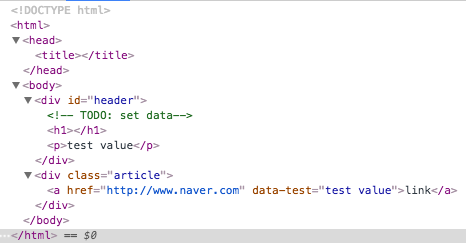
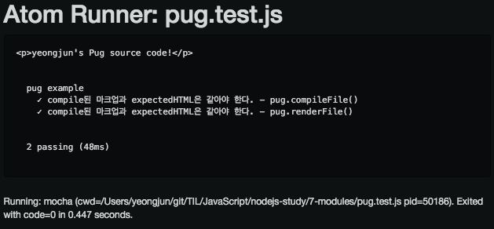
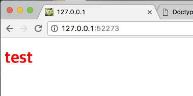
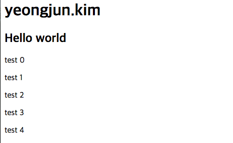

# 외부 모듈

:white_check_mark:*이것만큼은 기억하자*

| 개념              | 설명                                    |
| --------------- | ------------------------------------- |
| ejs 모듈 / pug 모듈 | 웹 페이지를 동적으로 생성하는 템플릿 엔진 모듈            |
| supervisor 모듈   | 파일의 변경 사항을 자동으로 인식하고 종료 후 다시 실행시키는 모듈 |
| forever 모듈      | 웹 서비스 장애와 같은 예외 상황을 대비하고자 만들어진 모듈     |
| npm install 명령  | 외부 모듈을 설치할 때 사용                       |
| npm init 명령     | Node.js 프로젝트를 생성할 때 사용                |
| package.json 파일 | Node.js 프로젝트의 환경 설정 정보를 담은 파일         |


## npm

> Node.js는 npm(Node Package Manager)을 기반으로 모듈을 공유한다

**Use**

```shell
$ npm install 모듈명
$ npm uninstall 모듈명
$ npm update 모듈명
$ npm search 모듈명
$ npm init # 프로젝트 생성
$ npm list --depth=0 # 현재 설치된 모듈 확인
```


## 템플릿 엔진 모듈

>  Node.js에서 가장 많이 사용하는 웹 프레임의크인 express 프레임워크가 템플릿 엔진으로 ejs 모듈과 pug 모듈을 주소 사용하므로 2가지 모두 살펴보자.

```shell
$ npm install --save-dev ejs pug
```

```javascript
var ejs = require('ejs'),
    pug = require('pug');
```


### ejs

| 태그           | 설명           |
| ------------ | ------------ |
| <% code %>   | 자바스크립트 코드 입력 |
| <%= value %> | 출력할 데이터      |

- ejs(Embedded JavaScript template)는 말 그대로 마크업 안쪽에 코드를 포함하는 형태
- 빠르게 스파게티 코드가 될 수 있음
- `render()` 메서드를 사용하여 HTML 페이지로 변환
- 더 많은 내용은 [ejs](https://github.com/tj/ejs)


#### Usage

*code*

```javascript
var ejs = require('ejs'),
    http = require('http'),
    fs = require('fs'),
    path = require('path');

http.createServer(function(request, response) {
    var file = path.resolve(__dirname, 'ejsPage.ejs'),
        data = {
            title: 'Cleaning supplies',
            supplies: ['mop', 'broom', 'duster']
        };

    fs.readFile(file, 'utf-8', function(error, markup) {
        response.writeHead(200, {
            'Countent-Type': 'text/html'
        });
        response.end(ejs.render(markup, data));
    });
}).listen(52273, function() {
    console.log('Server Running at http://127.0.0.1:52273')
});

```

*ejsPage.ejs*

```ejs
<h1><%= title %></h1>
<ul>
<% for(var i=0; i<supplies.length; i++) {%>
	<li><%= supplies[i] %></li>
<% } %>
</ul>
```

**Result:**

```html
<h1>Cleaning supplies</h1>
<ul>
	<li>mop</li>
	<li>broom</li>
	<li>duster</li>
</ul>
```


### pug

- `jade` -> `pug`으로 변경됨 [관련 링크](https://github.com/pugjs/pug/issues/2184#event-752816009)
- `ejs`는 :star:수가 3,107개지만, `pub`는 12,676개로 차이가 큼(2016.11.08 기준)
- 더 많은 내용은 [pug](https://github.com/pugjs/pug)


#### Usage

```javascript
const pug = require('pug');
// 1
const tpl = pug.compileFile(string);
tpl(option);
// 2
pug.renderFile(string, option);
```


##### case 1 - 기본 사용

```jade
doctype html
head
    title
body
    #header
        // TODO: set data
        h1
        p test value
    .article
        a(href="http://www.naver.com", data-test="test value") link
```

***Result:***



```html
<!DOCTYPE html><head><title></title></head><body><div id="header"><!-- TODO: set data--><h1></h1><p>test value</p></div><div class="article"><a href="http://www.naver.com" data-test="test value">link</a></div></body>
```

> **Zipping**: 클라이언트에게 재공할 웹 페이지 용량을 줄이는 것(소스 코드가 들여쓰기 없이 생성)


##### case 2 - `compileFile()`, `renderFile()` 사용

*tpl.test.pug*

```jade
p #{name}'s Pug source code!
```

*pug.test.js*

```javascript
const expect = require('chai').expect,
    pug = require('pug');

describe('pug example', function() {
    let data = {
        name: 'yeongjun'
    };
    const expectedHTML = '<p>' + data.name + '\'s Pug source code!</p>';

    console.log(expectedHTML);

    it('compile된 마크업과 expectedHTML은 같아야 한다. - pug.compileFile()', function() {
        const tpl = pug.compileFile(__dirname + '/tpl.test.pug');
        expect(expectedHTML).to.equal(tpl(data));
    });

    it('compile된 마크업과 expectedHTML은 같아야 한다. - pug.renderFile()', function() {
        const file = __dirname + '/tpl.test.pug'
        expect(expectedHTML).to.equal(pug.renderFile(file, data));
    });
});
```

***Result:***




##### case 3 - script, css 사용

script 혹은 css를 사용할 경우에는 `.`을 찍어줘야 한다.

```jade
doctype html
head
    style.
        h1 { color: Red; }
    script(src="https://code.jquery.com/jquery-1.12.4.js")
    script.
        $(document).ready(function() {
            $('h1').html('test');
        });
body
    h1
```

***Result:***




##### case 4 - data 사용

| 태그         | 설명                      |
| ---------- | ----------------------- |
| `- code`   | 자바스크립트 코드 입력            |
| `#{value}` | 데이터 출력                  |
| `= value`  | 데이터 출력(특정 태그의 전체 값에 추가) |

```jade
h1 #{name}
h2= description
- for(var index = 0; index < 5; index++) {
    p test #{index}
    // p=index test 불가능
- }
```

***Result:***




### 참고

- [Top 10 Templating Engines for JavaScript](https://colorlib.com/wp/top-templating-engines-for-javascript/) - Alex Ivanovs


## 서버 실행 모듈

```shell
$ sudo npm install -g supervisor forever
```

> `-g`: 전역 모듈은 터미널에서 곧바로 사용할 수 있는 모듈, 전역에 설치하므로 관리가 권한 필요(osx, linux)


### supervisor

- 변경 사항을 자동으로 인식하고 재실행해주는 모듈.
- 프로그램이 종료되면 다시 실행시키기 때문에 서버 프로그램을 실행할 때만 사용

```shell
$ supervisor test.server.js
```


### forever

- 종료되면 재실행해주거나 로그파일로 남겨주는 등의 관리 툴
- NodeJs는 싱글스레드라서 예외하나면 웹 서비스 전체가 죽음. 이러한 경우를 대비하고자 하는 모듈

```shell
$ forever start app.js
$ forever list
$ forever stop [pid]
```


#### pm2

- 프로세스 매니저
- 모니터링, 클러스터 모드 등 여러가지 기능 지원

```shell
$ sudo npm install -g pm2
```

##### 


## npm 옵션


### npm init

```shell
$ npm init # package.json 생성
```

***package.json***

- 프로젝트의 작성자, 버전, 이슈, 디펜던시, 라이센스 등 정보를 저장한 파일
- [참고 링크](http://programmingsummaries.tistory.com/385)


### npm install

```shell
$ npm install ejs@2.4.1 # 2.4.1 버전 설치
$ npm install ejs@2.3   # 2.3 버전 중 최신 설치
$ npm install ejs@2     # 2 버전 중 최신 설치
```

```shell
$ npm install --save pug # package.json - dependencise에 추가
```

#### dependencies 속성

| 기호         | 설명                                       |
| ---------- | ---------------------------------------- |
| *          | 최신 버전 설치                                 |
| *> 1.0.0*  | 1.0.0 버전보다 높은 버전 설치                      |
| *>= 1.0.0* | 1.0.0 버전보다 높거나 같은 버전 설치                  |
| *< 1.0.0*  | 1.0.0 버전보다 낮은 버전 설치                      |
| *<= 1.0.0* | 1.0.0 버전보다 낮거나 같은 버전 설치                  |
| *= 1.0.0*  | 1.0.0 버전 설치                              |
| *^1.0.0*   | 1.0.0 버전과 호환되는 버전 설치(1.0.0 ~ 2.0.0 사이에서 최신 버전 설치) |

>  ***Semver*** (Semantic Versioning)
>
> - 시멘틱 버저닝이란 버전 번호를 붙이는 규칙을 말함
>
> - 버전 번호를 명시하지 않고 *^0.0.1*라고 했을 경우, 호환되지 않은 수 있음.
>
>   - 모듈 개발자가 버전 숫자 명시하는 법을 몰라서 마음대로 정했을 경우.
>
>     ex) 완전히 갈아 엎었는데 *0.0.0*에서 *0.0.1*이 된 경우
>
>
> - 자세한 내용은 [이곳](https://semver.org/lang/ko)에서 확인.
