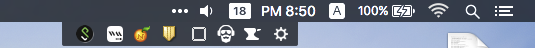
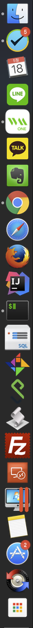

## 필수
- caps lock 키 control로 변경하기 - http://macnews.tistory.com/2240
- iterm
- 💵 BTT - 제스처 확장
- 💵 2do
- InsomniaX - 잠들기 취소
- 앱클리너
- Itsycal - 메뉴막대 시간 표시
- Karabiner - 키보드맵핑
- 스트리밍 노래 앱으로 연동하기 - http://doctypeht.ml/44
- 웹사이트 앱으로 만들기 - http://fluidapp.com/
- homebrew 설치
- http://www.sequelpro.com/
```
$ brew install tree
$ brew install htop
```
- 돋보기 활성화하기
- 시간 영어로 표기하기 - http://macnews.tistory.com/988
- 맥 단축키 알림 - https://www.mediaatelier.com/CheatSheet/
- 호스트 변경 - http://exifeedi.tistory.com/240
- 파일질라
- 패럴러즈
- http://www.trankynam.com/xtrafinder/, http://macnews.tistory.com/1216
- 압축 - the unarchiver
- 메뉴바에서 기본 메뉴 사라졌을 때 - http://iprize.tistory.com/574

##
- 시스템 모니터링 - https://itunes.apple.com/kr/app/id714196447?mt=12

# 20160518

