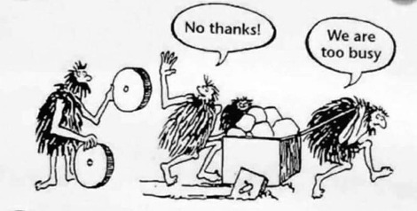

= The RED: 백발의 개발자를 꿈구며 : 코드리뷰, 레거시와 TDD by 백명석, 최범균
:toc:

== 성장

=== 개발자의 성장

* 지속 가능한 개발 이야기
** 개발자로써 지속적으로 성장하고자 하는 분들에게...
* 강사의 관심사
** 지속 가능한 소프트웨어, 시스템 개발(OOP), Java, TDD, Design Pattern
** Clean Code / Architecture, Code Review, Agile(Lean) Development
** MSA, EDA
** 개발 문화 개선
* 백발의 개발자
** 대부분의 구성원들이 나이 먹어도 개발자
** 어떻게하면 계속 개발할 수 있을까?
** 꿈? 백발의 개발자라면 어떤 계획이 있는가?
* 꿈을 위해서 무엇을 준비하고 있고, 무엇을 준비할 것인지?
* 그냥 열심히 일한다? 집에서 책을 본다? 이것만으로 백발의 개발자가 되는것인가?
** 시간이 없어서 못한다는 말을 많이 듣지만, 실력인지 시간인지 
** 실력이 있다면 그 시간에서도 실력이 나올텐데.
* 정신병자 초기 증상 - 아인슈타인
** "어제와 똑같이 살면서 다른 미래를 기대하는 것은 정신병 초기증세이다."

[NOTE]
====
"꿈을 위해 무엇을 준비하고 있고, 무엇을 준비할 것인가?"에 대해 선뜻 답할 수 없던 자신에게 부끄럽다. 앞으로 작게는 5년 계획, 크게는 10년 계획은 해보자.
시간이 없어서 못한다는 시간으로 실력 있어 보이려고 했던게 아닐까 생각들었다. '실력'을 키우자.
====

=== 왜 성장해야 하나?

* 하고 싶은 일을 할 기회를 늘리기 위해 (개선, 서비스, 탈오라클, ...)
* 성공은 운칠기삼
** 사람이 살아가는데는 앞을 알 수 없는 운명의 장난? but 3할은 이치도 틀림없이 행해지고 있음
** 결과 = (열심히 + 잘) * 기회
* 내가 잘하면 → 우리 서비스가 잘되고 → 우리 회사가 잘됨
* 어디에 집중? 내가 제어할 수 있는 것 / 제어할 수 없는 것
* 열심히는 누구나
** "받은 만큼만 일한다" vs **"받고 싶은 만큼 일한다"**
** 내가 제어할 수 있는 것에 집중 필요
* 열심히, 잘, 성공
** 기회가 오지 않더라도 성장한다면 언제든 성공 가능
** 지금 이직하지 않으면 좋은 오퍼가 앞으로 없을 것인지?
** 성장하고 있다면 더 좋은 오퍼는 언제든 올 것이다
* 지금 성공이 나중에는 미미한 것일 수도.
* 성장에 대한 다른 사람의 의견
** 성장은 본능
** 시간이 지나고 보면 성장 아니면 퇴보. 현장유지는 없음. 
** 가만히 있으면 퇴보
* 에이브러햄 매슬로의 욕구 5단계

image:https://martinfowler.com/articles/preparatory-refactoring-example/jessitron.png[link="https://martinfowler.com/articles/preparatory-refactoring-example.html"]

[quote, Benjamin Barber]
____
I don't divide the world into the weak and the stong, or the successes and failures...
I devide the world into the learners and non-learners.
____

[NOTE]
====
처음 회사에 입사했을 땐 "받고 싶은 만큼 일한다"고 마음 먹었고, 짧은 경력이 내 전부라 그게 오랜 시간이라 생각했고, 왜 (회사가 주는) 나의 평가/가치는 적은가에 대해 불만을 가졌다.
신입으로써 본받을 팀원을 넘어서자는 목표만으로 열심히 했었는데, 지금 생각하면 딱 거기까지만 성장하려 했던 것 같다. 결코 그를 넘어서진 않았던게 아닐까.

요즘엔 연봉에 대한 욕심이 전보다 줄었다. 마음 한켠에 "받은 만큼 일한다"는 생각이 자리 잡은 것 같다. 성격상 제대로, 잘하고 싶어서 어느하나 대충하진 않았지만 마음 한켠에 있는 생각 때문에 예전의 나보다 루즈해진 것 같다.
남과 비교하지 말고, 의식하지 말고, 개인의 성장에 집중하자.
====

==== 좋은 리더가 되려면?

* "많은 개발자는 좋은 리더에 대한 갈증을 느끼고, 실제로 좋다고 평가 받는 개발리더가 부족한것 같다. 좋은 개발 리더가 되려면 무엇을 해야 하는가"
* 리더란?
** 내가 잘하는 것이 아님. 그들이 잘하도록 도와줘야 함
* 진도가 잘 안나
* 구성원이 잘하도록 하는게 중
* 채용 여부가 고민되던 직원
** 부족하더라도 잘하도록 도와주고 기다려준다면 성장 가능성
* 리더란?
** 자신의 이익을 얻으면 남들에게 퍼주는 사람
** 선순환? 서로 성장하려는 사람들이 모임
* 구성원들의 모범
** "나도 저분처럼 되고 싶다"
* 개발자의 가장 큰 관심은 성장
** 구성원드링 성장과 경력에 대해서 고민하고 도움을 줘야
** 소통과 인정을 위한 기술 역량
** 지속 가능성
** 개발만 잘하는 것으로 부족...
*** 협업, 코칭, 커리어에도
*** 다음에도 같이 일하고 싶은 사람
* **성장과 성과 사이의 밸런스**
** 성장만 추구하면 오버엔지니어링이나 잘못된 결정을 할 수도
+
(YAGNI: You Ain't Gonna Need It - 지금 만드는 건 나중에 필요 없을꺼야. 필요한 것을 해라)
+
*** 개발자 동기부여 해주겠다고 운영툴을 다양한 언어로 구현한 경우도 있음..
*** 코드리뷰에 잘할수있는 방법을 의견을 제시했더니, 그 과제를 완수하기보단 책을 보고 공부하고 있는...
*** 지금은 동료와 같이 약속된 일정을 준수하는 것이 중요
** 성장과 성과 밸런스가 중요. 항상 업무와 연관지어서 성장해야지, 무관하게 책을보면서 성장하는것은 의미가 없지 않을까.
** 너무 성장만 추구해서 업무시간에 공부만 하는것은 말이 안되고, 리더는 업무에 몰입하고 성과를 내고 성장할 수 있도록 도와주는 것이 리더의 역할

=== 왜 학습해야 하나?

* 소프트웨어 개발업의 속성
** 공부해야하는 것이 계속 변함
** 배운 기술이 사라지는 경우가 많음
** 지속적으로 학습이 필요함
* 예전에 나온 것들도 계속 진화함
** 프로그래밍 언어의 개념이 정립된 시기
*** 1936 Functional
*** 1966 OOP
*** 1968 Structure
* 시간 vs 실력
** 나무에 앉은 새는 가지가 부러질까 두려워하지 않는다. 새는 나무가 아니라 자신의 날개를 믿기 때문이다
*** 개발자도 환경을 탓하기보단 자신의 실력을 쌓는 것이 중요
* 장인정신
** SW 개발의 80% 이상은 동작하고 나서부터 발생
** 진정한 코스트는 유지보수(80%)
** 코드 이해하는데 90%의 시간
** 코드를 읽는데 작성하는 것은 10배의 시간이 소요
* 학교에서는 과제를 내면 끝. 현업은 지속적인 개선, 기능 추가/변경

=== 성장학습하는 방법

* 롤모델
** 되고싶은 개발자 찾기
** 왜 잘하는지 탐구
* 측정하기
** 스스로라도 나를 측정하기. 결과/이유, 측정/개선
** 개발 항목을 주기적으로 측정
* 공유하기
** 개인적인 학습만으로는 성장에 한계
** 상호성장이 중요
** 공유 받는 사람보단 하는 사람이 잘됨
* 강사의 학습 방법
** RSS, News Letter, SNS, Youtube 강연
*** Feedly, Pocket, DEBONthink
** 제목만, 소개까지, 전체, 따라해보기, 책
** 근시일 내 할 일에 깊게 투자
* 소프트웨어 장신 정신
** 특정 기술에 대한 서적
*** 업무를 위해 FW, 언어, ..
*** 당장 업무에 유용하지만 가치는 오래가지 않음
** 특정 개념에 대한 서적
*** 커리어를 진전시킬 떄 필요한 기초를 쌓는 책
*** 새로운 개념, 패러다임, 실행 관례 등
*** 당장 활용하기 어렵고, 제대로 이해하고 습득하는게 긴 시간이 걸림. 기술 배우는 것보다 힘듦
*** TDD, DDD, OOP, FP, NoSQL, DB모델링 등
** 행동 양식에 대한 서적
*** 효율적으로 팀에서 일할 수 있게 안내하거나 일반적인 상황에서 더 나은 프로페셔널이 될 수 있도록 조언
*** 애자일 방법론, 소프트웨어 장인정신, 린 소프트웨어 개발, 심리학, 철학, 경영 등
** 혁명적 서적
*** 일하는 방식이나 개인의 가치관을 바꾸는 책
*** 실용주의 프로그래머, The Mythical Man-Month, Design Pattern(GoF), TDD(Kent Beck), Extreme Programing, Clean Code, Software Craftmanship(피트 맥브린), Refactoring
* 어려운 기술 학습 방법
** 의도적 수련
*** 일, 놀이, 수련의 구분
**** 같은 코드를 정해진 시간동안 매일 리팩토링해보기
**** 같은 장난감 문제 여러번 풀기
*** 고수와 하수를 가르틑 가장 효과적인 인자는 의도적 수련의 양
*** 업무만 열심히해서는 고수가 될 수 없음
*** 전문성 연구에 따르면 한 분야에 세계적 수준의 고수가 되려면 10년의 수렵 필요 or 1만 시간 이상
**** 1만시간 주5일 하루4시간 딱 10년
** shadow coding
*** TDD
** 아는 것, 할수있는 것, 하는 것(능동적인)
*** 일과 후 책 study? 부족
*** 토이 프로젝트
*** study vs 학습

> 클린코드, 클린코더는 SW개발업의 자기계발서 같은 느낌?
> 소프트웨어 장인정신

=== 취업과 동기부여

* 왜 개발자가 되었는지?
* 내가 즐겁게 일하는 것?
* 회사를 다니는 이유?

==== 일의 종류

* Green Field: 아무것도 없는것에서 만드는 것
* Brown Field: 온통 레거시를 개선하는 것
* 다시 만들 때만 나아질 수 있음
** 남이 만든 것을 자신이 만들면 다르게 만드는거지 잘 만드는 것은 아니다
* 일정 vs 품질
** 시험: 시간이 정해져 있음(오버엔지니어링)
** 돌아가게 빠르게 만들어서 검증하고 (지속해야 한다면 빠르게 잘 만드는 것이 기술)
** 모든 경우의 수를 고려해서 철저히 설계하지 말고 (마법의 수정구가 없음)

[NOTE]
====
"모든 경우의 수를 고려해서 철저히 설계하지 말고"라는 말이 혼란을 준다. 빠르게 만드는 것은 잘 만드는 것이라 하고, '빠르고, 잘' 만들어야 한다 하고, ...

'잘' 만든다는 것이 얼마만큼의 예상 가능하고 빠르게 만드는 것인지 아직 경험이 부족한 것 같다.
====

* 열정
** 재미/즐거운일
*** 이직률이 높음
** 가치를 추구
*** 의미 있는 일
*** 열정이 더 높음
** 난관을 만났을 때
* 취업
** 이전 회사의 문제? 이직할 회사에서는 당장에 그 문제가 없지만 생기면?
** 스스로 성장을 못하고 있다면?
* 동기부여
** 외적: 처우개선, (지속가능하지 않음)
** 내적
** 짝코딩, 코드리뷰등으로 공유가 늘어가면 성장, 공유에 열정이 생김
** 스스로 잘안되면 어떻게 해야 하느냐
*** 롤모델 탐구, 멘토링, 노력 vs 욕심
*** 부러워만하면 그건 욕심
* 신뢰와 협업
** 신뢰
*** 신뢰는 믿는 것이 아님
*** 예측 가능성
*** 신뢰가 쌓이면 이견/개선안을 제시할 수도
** 협업/커뮤니케이션
*** 애자일
*** 협력, 협업할 수 있는 역량
*** rnr, 나의 일? 우리회사의 일(kpi)에 좀 더 집중하기

== 코드리뷰

=== 왜 코드리뷰를 해야 하나?

* 대충 안다. 왜 하는지에 대해서 설명해줬으면...
* 시장과 비지니스의 요구사항
** 시장은 VUCA(Volatile, Uncertain, Complex and Ambiguous) 환경
** 사업은 더 빨리, 혁신적으로
** 개발은 더 빠르게, 더 자주, 더 안정적으로 배포해야 함
*** CI/CD에서 문제 없었다고 안정적일 수는 없음
* 배포별 개발 리소스 증가
+ image:https://miro.medium.com/max/1400/1*XnKchZ-i7gbtvaDfQKnmJw.png[]
* 배포횟수의 생산성
+
image:https://miro.medium.com/max/1400/1*3OEgLiNnZ-33MvxO5rZz-g.png[]
* 배포별 라인당 개발 비용
+
image:https://miro.medium.com/max/1400/1*xVjf850sWUaopX8UvWxZ4w.png[]
* 배포별 생산성
+
image:https://miro.medium.com/max/1400/1*f2CcfUVs4L7IJNuiGiEzGw.png[]
+
** 새로운 기능을 추가해야하므로 생선성이 100%
** 시간이 지날수록 기존코드를 읽는데 시간을 소비함

image:https://www.sandimetz.com/s/012-designStaminaGraph.gif[]

=== 코드 리뷰의 정의 / 목적 / 절차

=== 왜 코드리뷰가 어려운가?

=== 기법들

=== 추가적인 사례

== 레거시와 리팩토링

== TDD 소개

