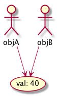
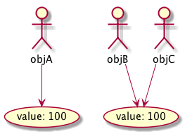
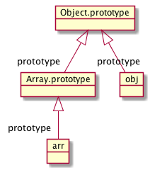
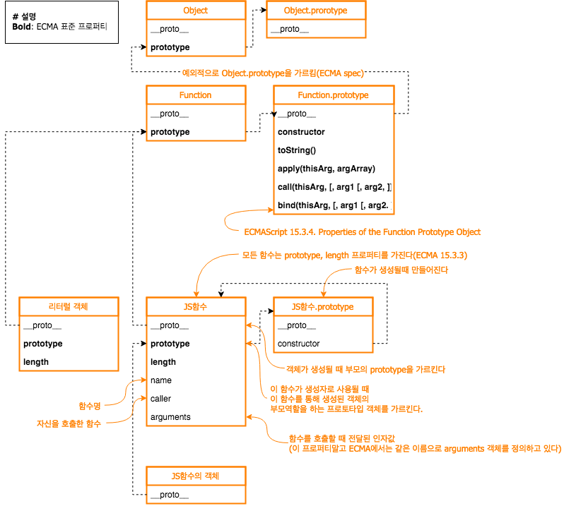

= 인사이드 자바스크립트 스터디 내용
김영준 <opid911@gmail.com>
:toc: left

== js
* 처음엔 그냥 보조적인 기능을 위한 용도, 렌더링 해주는 수준
* jquery, nodejs 등 발전해 나감
* "자바스크립트는 가장 무시당하고 있는 언어 중에 하나"(더글라스 크락포드)도 옛말이 되어가는 듯

=== js 활용 범위
* 웹 개발
** jquery, backbone, ...
* 서버 개발
** node.js, express, socket.io, ...
* 애플리케이션 개발
** electron, phonegap, ...

=== js 핵심 개념
* 객체
** js는 기본데이터 타입인 `boolean`, `number`, `string`, 특별한 값인 `null`, `undefined를` 제외하고 모든 것이 객체.
** 기본 데이터 타입은 모든 객체처럼 다룰 수도 있음.
** 즉, `null`, `undefined` 를 제외한 모든 것을 객체로 다룰 수 있음
* 함수
** js에서는 함수도 객체.
** js에서는 함수가 상당히 중요, 함수는 일급 객체(First class object)로 다뤄지기 때문.
* 프로토타입
** 모든 객체는 숨겨진 링크(Link)인 *프로토타입(Prototype)* 을 가진다
** 이 링크는 해당 객체를 생성한 생성자의 프로토타입 객체를 가르킨다.
** 이 링크를 ECMAScript 에서는 *\[[Prototype]]* 이라고 표현한다.
** 이 링크로 자신만의 자료 구조, 상속등을 표현할 수 있다.
* 실행 컨텍스트, 클로저
** js는 자신만의 독특한 과정으로 *실행 컨텍스트* 틑 만들고 그 안에서 실행이 이루어진다.
** 이 실행 컨텍스트는 자신만의 유효 범위(Scope)를 갖는데, 이 과정에서 *클로저*를 구현할 수 있다.

=== js 단점

* 느슨한 타입 체크
** 대안할 수 있는 것: TypeScript, React 사용시 PropTypes 설정
* 전역 객체의 존재
** ES6에서 `let`, `const` 로 해결

***
== js 데이터 타입과 연산자

=== 데이터 타입
* 기본 타입
** Number
** String
** Boolean
** undefined
** null
* 참조 타입
** Object
*** Array
*** Function
*** 정규표현식

=== 기본 타입
* `typeof` 연산자: 피연산자의 타입을 리턴
* js는 **느슨한 타입 체크 언어**, `var` 라는 한 가지 키워드로만 변수 선언
** ES6: `let`, `const` 타입 추가

==== 숫자

[source, js]
----
var intNum = 10;
console.log(typeof intNum); // "number"
----

* js에서는 하나의 숫자형만 존재
* 모든 숫자를 64비트 부동 소숫점 형태로 저장
* 정수형이 따로 없고, 모든 숫자를 실수형으로 처리하기 때문에 연산할 때 주의.

==== 문자열

[source, js]
----
var str = "test";
console.log(typeof str); // "string"
console.log(str[0], str[1], str[2], str[3]); // "test"
str[0] = "T";
console.log(str); // "test"
----

* 작은 따옴표나 큰 따옴표로 생성
* js는 한 번 생성된 문자열은 읽기만 가능하고 수정은 불가능

==== 불린값

[source, js]
----
var boolVar = true;
console.log(typeof boolVar); // "boolean"
----

==== null과 undefined

[source, js]
----
var emptyVar;
var nullVar = null;
console.log(emptyVar); // "undefined"
console.log(nullVar); // "object"
----

* js 환경 내에서 기본적으로 값이 할당되지 않은 변수는 `undefined`
* `undefined` 타입의 변수는 변수 자체의 값 또한 `undefined`
* 즉, js에서는 `undefined`는 타입이자, 값을 나타냄
* 개발자가 명시적으로 값이 비어있음을 나타낼 때는 `null`
* `null` 타입 변수의 `typeof` 결과는 `object`
* js에서는 null 타입 변수인지 확인할 때 typeof 연산자가 아닌, 일치 연산자(`===`)를 사용해야 한다.

[source, js]
----
var nullVal = null;
console.log(typeof nullVar === null); // false
console.log(nullVar === null); // true
----

=== 참조 타입(객체 타입)
* js에서 객체는 단순히 `key:value` 형태의 프로퍼티를 저장하는 컨테이너
* 프로퍼티가 함수일 때, 프로퍼티를 메서드라고 부른다.

==== 객체 생성 방법
1. 기본 제공 Object() 객체 생성자 함수를 이용
+
[source, js]
----
var foo = new Object();
foo.name = "foo";
foo.age = 30;
console.log(typeof foo); // "object"
console.log(foo); // {name: "foo", age: 30}
----

2. 객체 리터럴 방식 이용
+
[source, js]
----
var foo = {
    name: "foo",
    age: 30
}
----

3. 생성자 함수 이용: _4장 참고_

==== 객체 프로퍼티 읽기/쓰기/갱신
* 대괄호 표기법
* 마침표 표기법

==== 프로퍼티 동적 생성
[QUOTES]
____
js 객체의 프로퍼티에 값을 할당할 때, 프로퍼티가 이미 있을 경우는 해당 프로퍼티의 값이 갱신되지만, 객체의 해당 프로퍼티가 없을 경우에는 새로운 프로퍼티가 동적으로 생성된 후 값이 할당된다.
____

[source, js]
----
foo.major = "computer science";
----

==== NaN(Not a Number) 값
수치 연산을 해서 정상적인 값을 얻지 못할 때 출력되는 값.

==== 프로퍼티 출력

[source, js]
----
var foo = {
    name: "foo",
    age: 30
};

var prop;
for (prop in foo) {
    console.log(prop, foo[prop]);
}
----

==== 프로퍼티 삭제

[source, js]
----
var foo = {
    name: "foo",
    age: 30
};
delete foo.name;
console.log(foo); // {age: 30}
delete foo;
console.log(foo); // {age: 30}
----

`delete` 연산자는 객체의 프로퍼티를 삭제할 뿐, 각체 자체를 삭제하지는

=== 참조 타입의 특성

[source, js]
----
var objA = {
    val: 100
}
var objB = objA;
----

==== 객체 비교
* 동등 연산자(`==`)를 사용할 때, 객체의 프로퍼티 값이 아닌 참조값을 비교한다는 것을 주의
* 기본 타입은 값을 비교
* 참조 타입은 참조 값이 같아야 true

[source, js]
----
var a = 100;
var b = 100;
console.log(a == b); // true

var objA = { value: 100 };
var objB = { value: 100 };
var objC = objB;
console.log(objA == objB); // false
console.log(objB == objC); // true
----

==== 참조에 의한 함수 호출 방식
* call by value: 기본 타입
* call by reference: 참조 타입

=== 프로토타입
* js에서 모든 객체는 자신의 *부모 역할을 하는 객체(= 프로토타입 객체, 프로토타입)*와 연결되어 있다.
* ECMAScript 명세서에는 js의 **모든 객체는 자신의 프로토타입을 가리키는 `[[Prototype]]`이라는 숨겨진 프로퍼티**를 가진다고 설명 https://www.ecma-international.org/ecma-262/5.1/#sec-8.6.2[[ECMA spec 8.6.2]]
* 크롬 브라우저에서는 `__proto__`가 `[[Prototype]]` 프로퍼티를 의미한다.
* 모든 객체의 프로토타입은 js의 룰에 따라 객체를 생성할 때 결정 -> 프로토타입 체이닝에서 자세히
* 아래 코드와 같이 리터럴로 생성될 경우 `Object.prototype` 객체가 프로토타입 객체가 됨
* `Object.prototype` 객체에 포함된 메서드들은 js 표준 메서드로 ECMAScript spec에 정의. https://www.ecma-international.org/ecma-262/5.1/#sec-15.2.4[[ECMA spec 15.2.4]]

[source, js]
----
var foo = {
    name: "foo"
};

console.log(foo.toString());
----

=== 배열
* https://developer.mozilla.org/ko/docs/Web/JavaScript/Reference/Global_Objects/Array
* 배열 생성: 배열 리터럴(대괄호 `[]`)
* js가 배열 크기는 현재 배열의 인덱스 중 가장 큰 값을 기준으로 정함
* 모든 배열은 length 프로퍼티가 있음

[source, js]
----
let emptyArr = [];
console.log(emptyArr); // undefined

// 배열 요소 동적 생성
emptyArr[0] = 100;
emptyArr[3] = "strign";
emptyArr[7] = true;
console.log(emptyArr.length); // 8
----

[source, js]
----
let arr = [1, 2, 3];
let prop;
for (prop in arr) {
    console.log(prop, arr[prop]);
}
delete arr[1];
console.log(arr); // [1, undefined x 1, 3]
console.log(arr.length); // 3
----

==== 객체 프로토타입과 배열의 프로토타입

==== Array() 생성자 함수
* 배열 리터럴도 결국 js 기본 제공 **Array() 생성자 함수**로 배열을 생성하는 과정을 단순화시킨 것
* 반드시 new 연산자 같이 사용
* 인자가 1개이고 숫자일 경우, 인자를 length로 갖는 빈 배열 생성
* 그외의 경우, 호출된 인자를 요소로 갖는 배열 생성

==== 유사 배열 객체
* length 프로퍼티를 가진 객체를 **유사 배열 객체array-like objects**
* length 프로퍼티는 배열의 동작에 있어서 중요한 프로퍼티
* `apply()`를 사용하면 표준 배열 메서드 활용 가능
* 즉, 유사 배열 객체도 배열 메서드 사용 가능
* arguments, jQuery 객체가 유사 배열 객체 형태

==== 기본 타입과 표준 메서드
* 기본 값은 메서드 처리 순간에 객체로 변환된 다음 각 타입별 표준 메서드를 호출하고, 끝나면 다시 기본값으로 복귀
* 즉, 객체처럼 호출할 수 있음

**(+) ES6 spread operator**: https://developer.mozilla.org/ko/docs/Web/JavaScript/Reference/Operators/Spread_operator[link]

[source, js]
----
let arr1 = [1, 2, 3];
let arr2 = [...arr1, 4, 5];
console.log(arr2); // [1, 2, 3, 4, 5]

[a, b, ...iterableObj] = [1, 2, 3, 4, 5];
console.log(a, b); // 1 2
console.log(iterableObj); // [3, 4, 5]
----

=== 연산자

* `+`: 피연산자가 모두 숫자열 경우에만 더하기 연산, 나머지는 문자열 연산
* `typeof`: 피연산자의 타입을 문자열 형태로 반환

    | type | operand   | result
    | ---- | --------- | ----------- |
    | 기본타입 | 숫자        | 'number'    |
    | 기본타입 | 문자열       | 'string'    |
    | 기본타입 | 불린값       | 'boolean'   |
    | 기본타입 | null      | 'object'    |
    | 기본타입 | undefined | 'undefined' |
    | 참조타입 | 객체        | 'object'    |
    | 참조타입 | 배열        | 'object'    |
    | 참조타입 | 함수        | 'function'  |

* `==`(coercive equality), `===`(strict equality)
** 피연산자의 타입을 체크하는 차이점(`===`는 타입도 체크)
** 대부분 js 코딩 가이드에서 `==` 추천하지 않음
** (+) 더글라스 크락포드의 ***자바스크립트 핵심 가이드*** 에서도 `===` 권장
* `!!`: 피연산자를 불린값으로 변환
** 빈 객체라도 `true`로 반환: `!!{} = true`

***

== 함수와 프로포타입 체이닝

=== 함수 정의

1. function statement
2. function expression
3. Function() constructor function

==== 함수 리터럴

[source, js]
----
function name(arg1, arg2) {
    return arg1 + arg2;
}
----

* `function` 키워드: js 함수 리터럴은 function 키워드로 시작
* `name`: 함수명, 선택사항이며 함수명이 없으면 익명 함수라고 함
* `arg1, arg2, ...`: 매개변수 리스트, 타입을 지정하지 않음
* `{ return arg1 + arg2; }`: 함수 몸체, 실행 코드

==== 함수 선언문

[source, js]
----
function add(x, y) {
    return x + y;
}
----

* 반드시 함수명 정의

==== 함수 표현식

[source, js]
----
let add = function (x, y) {
    return x + y;
};
----

* add는 익명 함수를 가르키는 변수
* 함수 이름이 포함된 함수 표현식을 **기명 함수 표현식**이라 함
* 기명 함수 표현식일 때, 함수 내부에서만 함수명 사용이 가능
+
[source, js]
----
// as-is
function add(x, y) {
    return x + y;
}

// to-be
var add = function add(x, y){
    return x + y;
};
----
+
함수 선언문에서 함수 이름이 외부에서 호출 가능한 이유는 자바스크립트 엔진에 의해서 함수 표현식으로 변경되기 때문. (변수 선언과 초기화 작업이 분리되기 때문에 자세한 내용은 아래에서..)

* 함수 표현식 방식에 마지막에 세미콜론을 붙이는 것을 권장
+
[source, js]
----
var func = function() {
    return 42;
} // 세미콜론 없음
(function() {
        console.log("function called");
})();
----
+
위 코드와 같이 세미콜론이 없을 경우 `number is not a function` 에러가 발생한다. `func()`를 호출하면 42를 반환하고 다음 익명함수를 바로 실행하면서 `42()` 형태로 호출을 시도한다. 이런 문제가 발생할 수 있어, 많은 자바스크립트 가이드에서는 세미콜론 사용을 강력하게 권고하고 있다.

==== 생성자
* js 함수도 `Function()`이라는 기본 내장 생성자 함수로부터 생성된 객체
* 표현식, 선언문 방식도 내부적으로는 Function() 생성자 함수로 생성
* 일반적으로 사용하지 않음 (상식 수준에서 정리)

> new Function (arg1, arg2, ..., argN, functionBody)

[source, js]
----
var add = new Function('x', 'y', 'return x + y');
----

==== 호이스팅
* 함수 선언하는 방식마다 다른 점 중 하나 : function hoisting
* 더글라스 크락포드는 함수 표현식만을 사용할 것을 권고하도 있다. 그 이유 중 하나가 함수 호이스팅 때문.

**함수 호이스팅 예**

[source, js]
----
add(2, 3); // 5

// function statement
function add(x, y) {
    return x + y;
}

add(3, 4); // 7
----

* 함수 위치와 상관없이 함수 선언문 형태로 정의한 함수의 유효 범위는 코드의 맨 처음부터 시작한다. 이것을 **함수 호이스팅**이라고 함
* 더글라스 크락포드는 이러한 함수 호이스팅은 함수를 사용하기 전에 반드시 선언해야 한다는 규칙을 무시하므로 코드의 구조를 엉성하게 만들 수도 있다고 지적
* 함수 표현식으로 작성하면 호이스팅은 일어나지 않음
* 함수 호이스팅이 발생하는 원인은 자바스크립트의 <b>변수 생성Instantiation</b>과 **초기화Initialization** 작업이 분리되서 진행되기 때문

[source, js]
----
add(2, 3); // uncaught type error

// function expression
var add = function(x, y) {
    return x + y;
}

add(3, 4); // 7
----

=== 함수 객체

==== 자바스크립트에서는 함수도 객체다

[source, js]
----
function add(x, y) {
    return x + y;
}

add.result = add(3, 2);
add.status = "OK";
----

image::function-same-object.png[]

* js에서는 함수도 객체
* 함수가 프로퍼티들을 가질 수 있음
* 함수 코드는 **[[Code]] 내부 프로퍼티**에 자동으로 저장(ECMAScript 8.6.2)
* 즉, 함수도 일반 객체처럼 취급될 수 있음

==== js에서 함수는 값으로 취급된다
* js에서 함수는 **일급객체**라고 함, 다음과 같은 특징을 가진 객체를 말함
** 리터럴에 의한 생성
** 변수나 배열의 요소, 객체의 프로퍼티 등에 할당 가능
** 함수의 인자로 전달 가능
** 함수의 리턴값으로 리턴 가능
** 동적으로 프로퍼티를 생성 및 할당 가능

===== 변수나 프로퍼티의 값으로 할당

[source, js]
----
var bar = function() { return 100; };
var obj = {};
obj.baz = function() { return 200; };
----

===== 함수 인자로 전달

[source, js]
----
var foo = function(funz) { funz(); };
foo(function() { console.log("test"); });
----

===== 리턴값으로 활용

[source, js]
----
var foo = function() {
    return function() {
        console.log("test");
    };
};
var bar = foo();
bar();
----

==== 함수 객체의 프로퍼티

=== 함수의 다양한 형태

==== 콜백 함수
* 함수를 등록하면 이벤트 발생시 시스템에서 호출되는 함수

[source, js]
----
window.onload = function() {
    alert('This is the callback function.');
}
----

==== 즉시 실행 함수(Immediate functions)
* 최초 한 번의 실행만을 필요로 하는 초기화 코드 부분에 활용
* 전역 네임스페이스를 더럽히지 않고, 변수명 충돌을 막기 위해 활용(e.g. jQuery)

[source, js]
----
(function (name) {
    console.log('This is the immediate function -> ' + name);
})('foo');
----

==== 내부 함수(Inner function)
* 클로저를 생성하거나 부모 함수 코드에서 외부에서의 접근을 막고 독립적인 헬퍼 함수를 구현하는 용도 등으로 사용
* 내부 함수는 자신을 뚤러싼 외부 함수의 변수에 접근 가능(스코프 체이닝)

[source, js]
.source
----
function parent() {
    var a = 100;
    var b = 200;

    function child() {
        var b = 300;

        console.log(a);
        console.log(b);
    }
    child();
}
parent();
child();
----

.result
----
100
300
Uncatght ReferenceError: child is not defined
----

[source, js]
.source
----
function parent() {
    var a = 100;

    var child = function() {
        console.log(a);
    }

    return child;
}
var inner = parent();
inner();
----

.result
----
100
----

==== 함수를 리턴하는 함수

[source, js]
.source
----
var self = function () {
    console.log('a');
    return function () {
        console.log('b');
    }
}
self = self();
self();
----

.result
----
a
b
----

=== 함수 호출과 this

==== arguments 객체
* 자바스크립트는 인자를 어떻게 넘기더라도 함수를 호출할 때 에러가 발생하지 않는다.
* 정의된 함수의 인자보다 적게 함수를 호출했을 경우, 나머지 인자에는 undefined 값이 할당된다.
* 정의된 함수의 인자보다 많게 함수를 호출했을 경우, 초과된 인수는 무시된다.
* arguments 객체는 실제 배경이 아닌 *유사 배열 객체* 다.

==== 호출 패턴과 this 바인딩
* 자바스크립트에서 함수를 호출할 때 기존 매개변수로 전달되는 인자값에 더해, arguments 객체 및 this 인자가 함수 내부로 암묵적으로 전달된다.

===== 객체의 메서드 호출할 때 this 바인딩
* 객체의 프로퍼티가 함수일 경우, 이 함수를 메서드라 부른다.
* this는 해당 메서드를 호출한 객체로 바인딩된다.

[source, js]
.source
----
var myObject = {
    name: 'foo',
    sayName: function() {
        console.log(this.name);
    }
};

var otherObject = {
    name: 'bar'
};
otherObject.sayName = myObject.sayName;

myObject.sayName();
otherObject.sayName();
----

.result
----
foo
bar
----

===== 함수를 호출할 때 this 바인딩
* 함수 내부 코드에서 사용된 this는 전역 객체에 바인딩 된다.
* 전역 객체
** 브라우저: `window`
** Node: `global`

===== 생성자 함수를 호출할 때 this 바인딩
*

===== call과 apply 메서드를 이용한 명시적 this 바인딩

=== (+) js function
* js의 함수는 이벤트 루프에 들어있는 하나의 큐 안에서는 완전한 동기로 동작하며, 몇몇 함수는 비동기(setTimeout, setInterval, XMLHttpRequest, ...)로 동작한다.
* setTimeout은 JS로 호출하지만 JS함수가 아님, eval함수 처럼
* callback은 비동기에서 결과를 받아서 처리하기 위한 방법
* 콜백은 비동기 함수에서 결과로써 실행해줄 함수를 넘기는 패턴이죠. 비동기라 결과를 대기하는 방법이 없으니까
* https://www.youtube.com/watch?v=8aGhZQkoFbQ
* http://meetup.toast.com/posts/89
* https://github.com/codebusking/nodejs-getting-started-with-beginners
