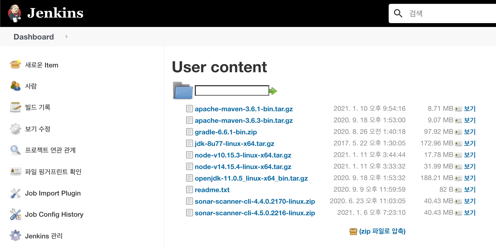
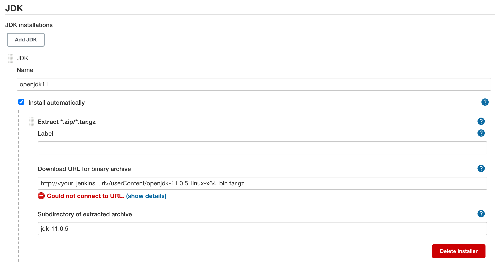

= userContent 디렉토리 활용하기

.key point
****
`userContent` 활용(이곳에 각종 설치파일을 저장해서 `wget` 으로 활용 가능)
****

. FreeStyle 작업 생성
. `General` 매개변수 옵션추가
+
[source]
.Chioce Paramter
----
Name: ACTION
Choices: UPLOAD
         DELETE
----
+
[source]
.String Paramter
----
Name: FILE_NAME

[x] Trim the string
----
+
[source]
.File Parameter
----
File location: tmpFile
----
. `Restrict where this project can be run` 옵션에 `master` label 추가
+
(master 노드에서만 실행되도록 설정)
. `Build > Execute shell` 스텝 추가
+
[source, bash]
.Command
----
[[ -z "$FILE_NAME" ]] && { echo "FILE_NAME is required" ; exit 1; }

if [ "$ACTION" == "UPLOAD" ]; then
  FILE=tmpFile
  [[ ! -f "$FILE" ]] && { echo "The file does not exist" ; exit 1; }
  mv $FILE $JENKINS_HOME/userContent/$FILE_NAME
else
  [[ $FILE_NAME == *"-rf"* ]] && { echo "'-rf' cannot be included in the FILE_NAME" ; exit 1; }
  rm $JENKINS_HOME/userContent/$FILE_NAME
fi

echo "URL: ${JENKINS_URL}userContent"
----

. Global Tool Configuration 설정에서 JDK 추가
+

[WARNING]
====
Jenkins pipeline 으로 만들어보려고 했으나 File Parameter 버그가 있어서 업로드가 안됨
====
