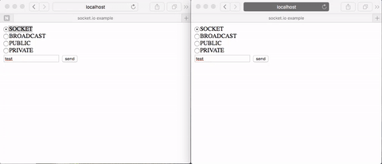
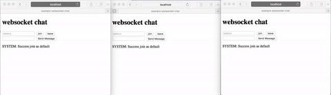

# socket.io

> Socket.IO enables real-time bidirectional event-based communication.
> It works on every platform, browser or device, focusing equally on reliability and speed.
>
> [*socket.io*](http://socket.io/)

socket.io 모듈은 웹 소켓(지원하지 않는다면 롱 폴링) 통신을 사용할 수 있게 해준다.

**웹 소켓**: HTML5에서 제공하는 [RFC 6455 프로토콜](https://tools.ietf.org/html/rfc6455)을 사용한 양방향 통신 기능

**롱 폴링**: ([참고1](http://d2.naver.com/helloworld/1052), [참고2](https://taegon.kim/archives/2535))


## Installation

홈페이지: [socket.io-Download](http://socket.io/download/)

**server**:

```shell
$ npm install socket.io
```

**client**: [git](https://github.com/socketio/socket.io-client)

```html
<script src="https://cdn.socket.io/socket.io-1.4.5.js"></script>
<script src="http://your-io-server/socket.io/socket.io.js"></script>
<script src="/socket.io/socket.io.js"></script>
```


## Usage


### socket.io 이벤트

```javascript
io.sockets.on('connection', socket => {
  socket.on('disconnect', () => {
    console.log(socket.id)
  });
});
```

| event      | desc                         |
| ---------- | ---------------------------- |
| connection | 클라이언트가 연결할 때 발생              |
| disconnect | 클라이언트가 연결을 해제할 때 발생(브라우저 종료) |


### socket.io 메서드

```javascript
const io = require('socket.io')(server);
io.sockets.on('connection', socket => {
  socket.on('message', message => {
    console.log(message);
    socket.emit('msg', `${socket.id}: ${message}`);
  });
});
```

```html
<script src="/socket.io/socket.io.js"></script>
<script>
  const socket = io();
  socket.emit('message', 'test');
  socket.on('msg', data => {
    alert(data);
  });
</script>
```

| method | desc       |
| ------ | ---------- |
| on()   | 소켓 이벤트를 연결 |
| emit() | 소켓 이벤트를 발생 |


```javascript
let currentRoom = 'default';
socket.on('join', room => {
  if (!room) room = currentRoom;

  console.log(`join to ${room}`);
  socket.leave(currentRoom)
        .join(room);
  currentRoom = room;
});
socket.on('message', message => {
  socket.to(currentRoom).emit('message', {
    sender: socket.id,
    content: message
  });
});
```

| method                            | desc               |
| --------------------------------- | ------------------ |
| join()                            | 클라이언트를 방에 추가       |
| leave()                           | 클라이언트를 방에서 제거      |
| io.sockets.in() / io.sockets.to() | 특정 방에 있는 클라이언트를 추출 |


### 소켓 통신 종류

```javascript
// server
socket.on('type', type => {
  /* to me */
  socket.emit('echo', 'socket');

  /* broadcast */
  socket.broadcast.emit('echo', 'broadcast');

  /* public */
  io.sockets.emit('echo', 'public');
  
  /* private */
  io.sockets.to(id).emit('echo', 'private');
  // io.sockets.in(id).emit('echo', data);
  }
});
```

| type      | desc                  |
| --------- | --------------------- |
| public    | 자신의 포함한 모든 클라이언트에게 전달 |
| broadcast | 자신을 제외한 모든 클라이언트에게 전달 |
| private   | 특정 클라이언트에게 전달         |


## Example



```javascript
// 실행
// $ export DEBUG=socket.io* & node server
var http = require('http'),
    fs = require('fs'),
    socketio = require('socket.io');

var server = http.createServer((req, res) => {
    fs.readFile('page.html', function(error, data) {
        res.writeHead(200, {
            'Content-Type': 'text/html'
        });
        res.end(data);
    });
}).listen(52273, () => {
    console.log('Server running at http://localhost:52273');
});

var io = socketio.listen(server),
    id = 0;
io.sockets.on('connection', socket => {
    // 이렇게하면 가장 최근에 접속한 클라이언트 저장
    id = socket.id;
    socket.on('createSocket', data => {
        console.log('Recive Data:', data);

        switch (data.type) {
            case 'SOCKET':
                socket.emit('echo', 'socket');
                break;
            case 'BROADCAST':
                socket.broadcast.emit('echo', 'broadcast');
                break;
            case 'PUBLIC':
                io.sockets.emit('echo', 'public');
                break;
            case 'PRIVATE':
                io.sockets.to(id).emit('echo', 'private');
                // io.sockets.in(id).emit('echo', data);
                break;
        }
    });
});
```

```html
<!DOCTYPE html>
<html>
<head>
    <meta charset="utf-8">
    <title>socket.io example</title>
    <script src="/socket.io/socket.io.js"></script>
    <script>
        window.onload = () => {
            var socket = io.connect();

            socket.on('echo', data => {
                alert('[ID] ' + socket.id + '\n' + data);
            });

            document.getElementById('btnSend').onclick = () => {
                var type = [].slice.call(document.getElementsByName('chkType'), 0).filter((radio) => {
                    return radio.checked;
                })[0].value;
                socket.emit('createSocket', {
                    type: type,
                    msg: document.getElementById('txtMsg').value
                });
            };
        };
    </script>
</head>
<body>
    <label><input type="radio" name="chkType" value="SOCKET" checked="checked">SOCKET</label><br />
    <label><input type="radio" name="chkType" value="BROADCAST">BROADCAST</label><br />
    <label><input type="radio" name="chkType" value="PUBLIC">PUBLIC</label><br />
    <label><input type="radio" name="chkType" value="PRIVATE">PRIVATE</label><br />
    <input type="text" id="txtMsg" />
    <input type="button" id="btnSend" value="send" />
</body>
</html>
```


## Example - room



```javascript
'use strict';

const express = require('express');
const app = express();
app.use(express.static('.'));

const server = app.listen(52273, () => console.log('Server Runnuing.'));
const io = require('socket.io')(server);

io.on('connection', client => {
    let currentRoom = 'default';

    // 불가능
    client.on('connect', () => {
        console.log('connect chat');
    });

    client.on('join', (room, fn) => {
        if (!room) {
            room = currentRoom;
        }

        console.log(`connect: ${room}`);
        client.leave(currentRoom)
              .join(room);
        currentRoom = room;

        // io.sockets.to(client.id).emit('join', currentRoom);
        // io.sockets.to(client.id).emit('connect'); 호출 불가능

        if (fn) {
            fn({
                success: true,
                message: `Success join as ${currentRoom}`
            });
        }
    });

    client.on('message', message => {
        client.to(currentRoom).emit('message', {
            sender: client.id,
            content: message
        });
    });

    client.on('leave', () => {
        client.leave(currentRoom);
        currentRoom = undefined;
        console.log(`${currentRoom} leaved`);
    });

    // 브라우저 종료하면 발생
    client.on('disconnect', socket => {
        client.leave(currentRoom);
        console.log(`${currentRoom} that ${socket.id}\'s room disconnected.`);
    });
});
```

```html
<!DOCTYPE html>
<html>
<head>
    <meta charset="utf-8">
    <title>example websocket chat</title>
</head>
<body>
    <h1>websocket chat</h1>
    <div>
        <input id="room" type="text" placeholder="defalut" />
        <button id="join">join</button>
        <button id="leave">leave</button>
    </div>
    <div>
        <input id="message" type="text" />
        <button id="send">Send Message</button>
    </div>
</body>
<script src="/socket.io/socket.io.js"></script>
<script type="application/javascript">
    'use strict'

    const socket = io();

    document.getElementById('join').onclick = e => {
        socket.emit('join', document.getElementById('room').value, joinCallBack);
        // socket.emit('connect'); 호출 불가능
    };

    document.getElementById('leave').onclick = e => {
        socket.emit('leave');
    };

    document.getElementById('send').onclick = e => {
        const $message = document.getElementById('message');

        socket.emit('message', $message.value);
        document.body.appendChild(getMessageTpl({
            sender: 'YOU',
            content: $message.value
        }))

        $message.value = '';
    };

    // socket이 연결되면 발생, 내가 따로 서버에서 호출 불가능
    socket.on('connect', () => {
        console.log(`Connected as ${socket.id}`);
        socket.emit('join', undefined, joinCallBack); // join defaults
    });

    socket.on('message', message => {
        document.body.appendChild(getMessageTpl(message));
    });

    function getMessageTpl(data) {
        const $p = document.createElement('p');
        $p.appendChild(document.createTextNode(`${data.sender}: ${data.content}`));
        return $p;
    }

    function joinCallBack(result) {
        if (result && result.success) {
            document.body.appendChild(getMessageTpl({
                sender: 'SYSTEM',
                content: result.message
            }));
        }
    }
</script>
</html>
```