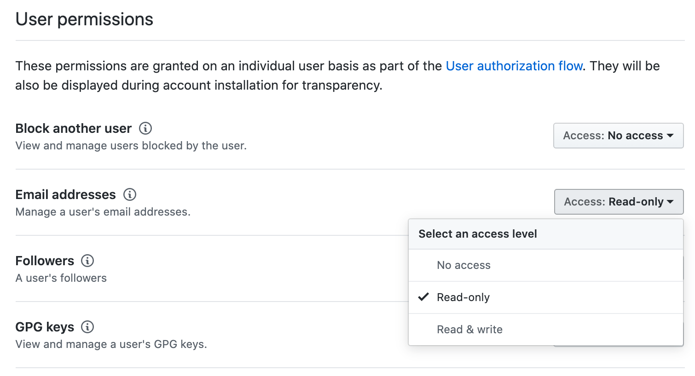

= Troubleshooting

== github enterprise 설치

=== OAuth 플러그인 따로 사용하지 않고 ALM 설정으로 로그인 연동시 아래 에러 발생

[source]
.soanrqube 인스턴스 로그
----
java.lang.IllegalStateException: Fail to execute request 'https://your-company.com/api/v3/user/emails'. HTTP code: 403, response: {"message":"Resource not accessible by integration","documentation_url":"https://developer.github.com/enterprise/2.19/v3/users/emails/#list-email-addresses-for-a-user"}
----

.해결방안
. GitHub Apps 이동
. 소나큐브 앱 선택
. "Permissions > User permissions > Email addresses" 설정에 `Read-only` 추가 필요
+

== lombok 설정

`lombok.config` 파일에 아래 설정 추가

[source, config]
----
# tells Lombok that this is the root directory and that it shouldn’t search parent directories for more configuration files
config.stopBubbling = true
# tells Lombok to add @lombok.Generated annotation to all generated methods
lombok.addLombokGeneratedAnnotation = true
----
