**목차**
1. [SonarQube - 소개](https://github.com/wicksome/TIL/blob/master/sonarqube/v1.md)
    > 간략한 소나큐브 및 Developer Edition 기능 소개
2. **SonarQube - 분석**
    > 파이프라인으로 소나큐브 분석 방법
3. [SonarQube - 팁](https://github.com/wicksome/TIL/blob/master/sonarqube/v3.md)
    > SonarLint 사용방법, SonarQube 활용, 다양한 Pipeline 설정 등

# TL;DR

**SonarQube 적용 전 해야할 일**
- 본인이 속한 GitHub 조직에서 SonarQube에 접근이 필요한 team 등록. (SonarQube 권한 템플릿에 등록할 그룹을 설정하기 위함)
- SonarQube에서 분석에 사용할 프로젝트 키의 `prefix` 정의. (SonarQube 그룹에 프로젝트 맵핑하는 정규식을 설정하기 위함)

**SonarQube 분석 방법**
- SonarQube 분석은 [공식 문서](https://docs.sonarqube.org/latest/analysis/overview/)를 통해 다양한 분석 방법을 확인할 수 있습니다.

# SonarQube 살펴보기

- [GitHub Authentication](https://docs.sonarqube.org/latest/instance-administration/delegated-auth/)을 적용하면, GitHub 계정을 통해 로그인 할 수 있습니다.
- 'Synchronize teams as groups' 기능을 활성화하면 GitHub 로그인시 소속된 team과 동일한 SonarQube 그룹에 자동으로 속하게 됩니다.

<p align="left">
  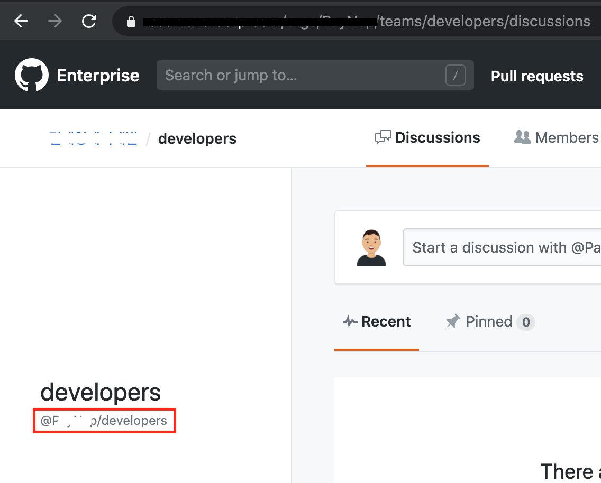
  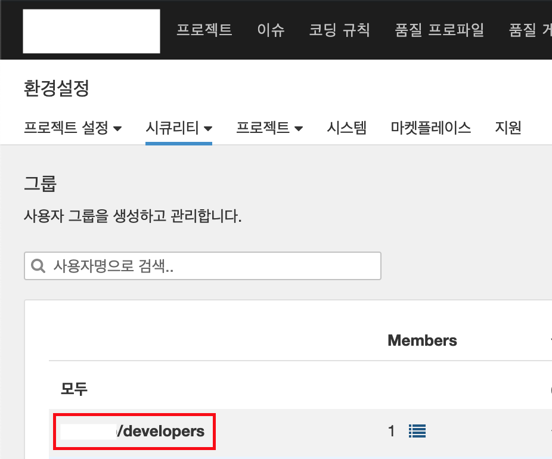
</p>

# 정적분석 사용하기

1. SonarQube Project 생성
2. SonarQube Token 발급
3. SonarQube Webhook 설정
3. Jenkins에 SonarQube 플러그인 설치 및 셋팅
4. SonarQube 분석 및 확인

> 여기서부터 속한 팀의 분석 시나리오로 작성되었습니다. 개발은 멀티-메이븐 구조로 작성된 하나의 Repository에서 진행중이며, maven 옵션을 통해 컴포넌트별로 리포트를 생성하고, [SonarScanner](https://docs.sonarqube.org/latest/analysis/scan/sonarscanner/) CLI를 통해 코드 분석을 하고 있습니다. [공식문서](https://docs.sonarqube.org/latest/analysis/scan/sonarscanner-for-jenkins/)을 참고하시면 다양한 방법으로 소스코드 분석이 가능합니다(Gradle, Maven, Etc).

> *아래 내용 모두 제 개인적인 고민의 결과임으로 개인 혹은 팀의 의견에 따라 변경될 수 있습니다
> 
> **SonarQube Scanner CLI를 사용한 이유:**
> &nbsp;&nbsp;Jenkins에서 SonarQube Scanner 를 직접 설치하여 CLI를 통한 분석을 하고 있습니다. 이전에는 maven의 `mvn sonar:sonar` goal을 추가해서 사용했으나, 분석 설정 변경이 있을 때 빌드와 관련이 없어도 `pom.xml`을 수정해야 했고, 초기 구축 단계에서 분석 설정 변경이 있을 때마다 PR을 생성해야 하는 불편함이 있었습니다.
> 
> **Pipeline을 사용한 이유:**
> &nbsp;&nbsp;Freestyle project를 사용할 경우 UI를 통해 누구나 설정이 가능하지만 형상관리가 어려웠습니다. 이에 반해 Pipeline은 초기 학습비용이 들지만 `Jenkinsfile`로 저장하면 형상관리가 가능하고, 각 stage 별로 실행시간도 확인할 수 있습니다. 또한 [Blue Ocean](https://www.jenkins.io/projects/blueocean/)과 연동되어 CD pipeline을 시각적으로 확인 할 수 있습니다.
> <p align="center">
>   
>   
> </p>
> + 2020. 7. 5 추가
>
> [Job Configuration History](https://plugins.jenkins.io/jobConfigHistory/) Plugin을 사용하면 job의 변경 이력을 확인할 수 있습니다.

## SonarQube Project 생성

1. SonarQube 오른쪽 상단에 `+` 버튼을 통해 프로젝트 생성합니다.
    > http://{sonarqube-url}/project/create?mode=manual

    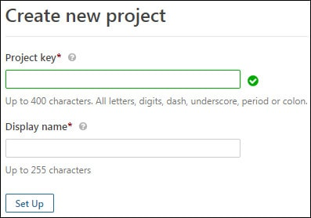
2. Project Key는 유니크한 키여야 하며 아래 컨벤션으로 부탁드립니다.
    > 아래 컨벤션 내용은 조직 내에서 유니크한 키값을 가지기 위해 임의로 정의한 내용입니다.

    ```bash
    <prefix>:<project-key>
    ```
    - Project Key는 `_`, `-`, `:`, `.` 와 숫자, letters, numbers 입력이 가능합니다.
    - `<prefix>`는 팀마다 중복되지 않은 값으로 `:` 구분자 사용을 부탁드립니다.
        > 이 값은 Permision Template의 Project Key Pattern에 정규식으로 추가할 값으로 처음 생성할 경우 메신저로 전달 부탁드립니다.
        > Permision Template에 Group을 설정함으로 프로젝트 생성시 바로 소속된 팀의 분석 결과를 확인할 수 있게 합니다.

        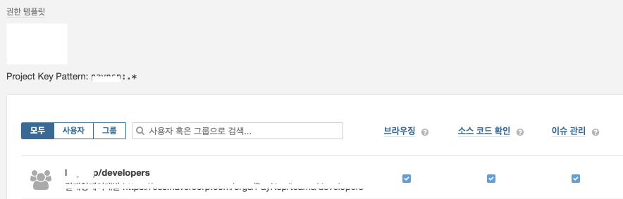
    - `<project-key>`는 팀내에서 각 분석 프로젝트마다 구분하기 위한 값으로 설정바랍니다.
    - 반드시 프로젝트 키를 설정하여 분석바랍니다. (maven 프로젝트인 경우 프로젝트 키를 설정하지 않고 분석을 실행시키면 "groupId:artifactId"로 설정됩니다)

## SonarQube Token 발급

1. SonarQube에서 '내계정 > 보안' 탭에서 토큰을 생성합니다.
    > https://{sonarqube-url}/account/security/
2. Jenkins에서 "New Credentials"을 통해 발급받은 토큰을 등록합니다.
    > http://<your-jenkins-url>/credentials/store/system/domain/_/newCredentials

    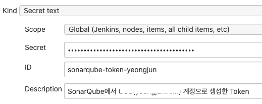

## SonarQube Webhook 설정

SonarQube에 Webhook을 생성하는 이유는 이후에 작성할 Pipeline에서 분석 결과 이후에 품질 게이트 결과를 받기 위함입니다.
품질 게이트 결과를 받음으로써 PR 분석에서 품질 게이트를 통과한 브랜치에 대해서만 머지할 수 있도록 강제할 수 있습니다.

> 자세한 내용은 [공식 문서](https://docs.sonarqube.org/latest/analysis/scan/sonarscanner-for-jenkins/#header-6)를 통해 확인하실 수 있습니다.

1. SonarQube의 해당 프로젝트에 접근합니다.
2. 오른쪽 상단 "Project Settings > Webhooks"를 통해 Webhook 관리 페이지로 접근합니다.
    <p align="center">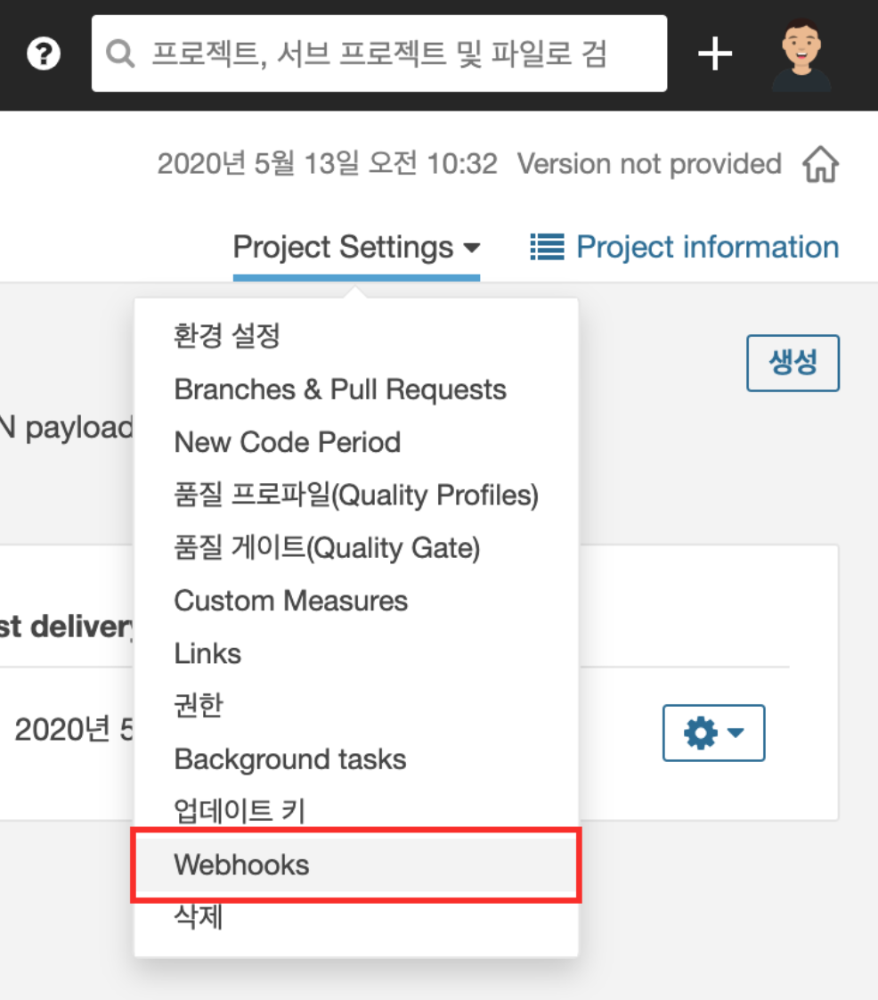</p>
3. "생성" 버튼을 통해 해당 프로젝트의 Webhook을 추가합니다. `URL`은 `<jenkins-url>/sonarqube-webhook/`으로 설정합니다.
    <p align="center">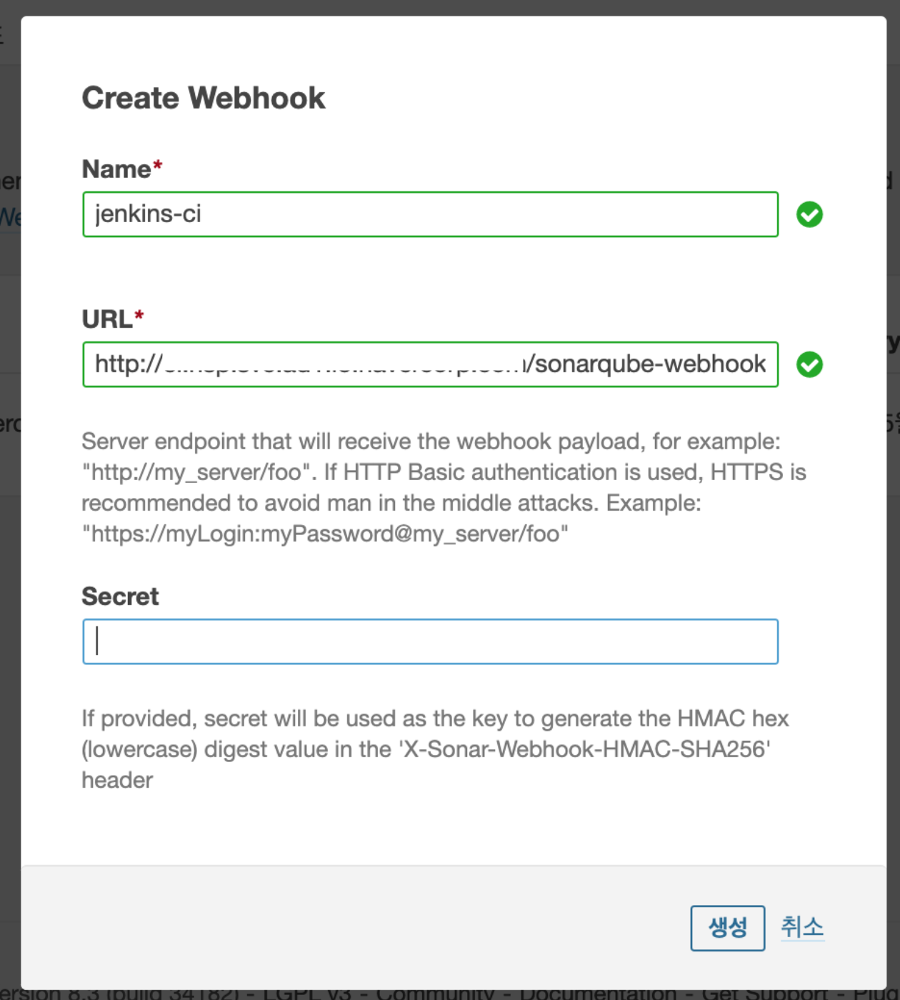</p>
4. 이후 작성할 Pipeline에서 SonarQube Scanner를 통해 코드를 전송하면 webhook을 기다리다가 분석 완료 webhook을 받으면 아래와 같은 로그를 확인할 수 있습니다.
    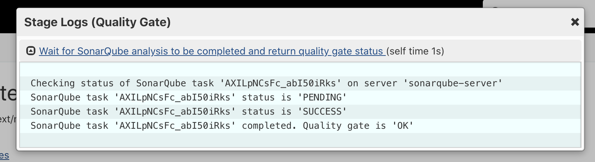

## Jenkins에 SonarQube 플러그인 설치 및 셋팅

### SonarQube 플러그인 설치

1. Jenkins에 [SonarQube](https://plugins.jenkins.io/sonar/) 플러그인을 설치합니다.
2. `Jenkins 관리 > 시스템설정`에서 'SonaQube servers'를 설정합니다.
    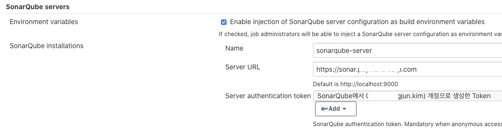
    > - 'Name'은 Pipeline Script의 `tool`에 사용됩니다.
    > - 'Server URL'은 구축한 SonarQube의 URL로 설정합니다.
    > - 'Server authentication token'은 이전에 발급받은 Token을 설정합니다.

### SonarQube Scanner 설치

> Pipeline Script에서 직접 SonarQube Scanner를 실행하기 위해 설치합니다. Maven이나 Gradle을 이용하시면 설치할 필요 없습니다.

1. Jenkins에서 'Jenkins 설정 > Global Tool Configuration'에 접근합니다.
2. 'SonarQube Scanner installations'를 통해 새로운 SonarQube Scanner를 설치합니다.
    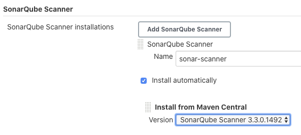

## SonarQube 분석 및 확인

### Multibranch Pipeline 추가

1. Jenkins에서 분석을 실행할 Item을 추가합니다.
    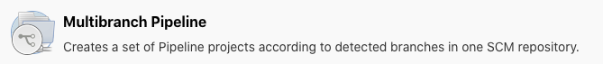
2. "Branch Source - Credentials"에는 브랜치와 PR을 스캔하고 소스를 체크아웃하기 위한 계정을 설정해줍니다. 이후에 분석 결과가 설정한 계정으로 commit status로 추가됩니다.
    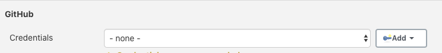
    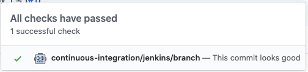
3. "Branch Sources - Repository HTTPS URL"에는 분석에 사용할 저장소를 설정합니다.
4. "Build Configuration"을 설정합니다. 아래에 작성할 `Jenkinsfile`의 경로를 설정합니다. 이 설정을 통해 빌드/분석 파이프라인을 분리할 수 있습니다.
5. "Scan Repository Trigger"를 설정합니다. 이 설정은 어느 주기로 저장소를 확인할지를 설정합니다.

> **Multibranch Pipeline을 사용한 이유**
> 
> &nbsp;&nbsp;예전에는 master/develop 브랜치는 webhook을 사용하고, PR 분석은 [GitHub Pull Request Builder](https://plugins.jenkins.io/ghprb/) 플러그인을 사용했었습니다. 하지만 GitHub Pull Request Builder 플러그인은 앞으로 [GitHub Branch Source Plugin](https://plugins.jenkins.io/github-branch-source/)로 마이그레이션 될 것이라 가이드하고 있었고, CI/CD를 운영하면서 두 개를 관리해야하는 불편함도 있었습니다.
> [Multibranch Pipeline](https://plugins.jenkins.io/workflow-multibranch/)를 사용하면 하나의 저장소(repository)에 대해서 하나의 jenkins item으로 관리할 수 있었고, Jenkins에서 직접 폴더를 통해 PR을 구분하지 않아도 되며, 블루 오션 UI를 통해서도 명확하게 관리할 수 있었습니다.
> - GitHub 조직을 전체로 관리하려면 "GitHub Organization" 아이템으로 생성할 수 있습니다.
> - Multibranch Pipeline에서 자동으로 추가되는 commit status를 없애기 위한 플러그인: [Disable GitHub Multibranch Status](https://plugins.jenkins.io/disable-github-multibranch-status/)

### Jenkinsfile 추가

분석을 실행할 저장소의 원하는 경로에 `Jenkinsfile`을 추가합니다. `Jenkinsfile`은 Jenkins Pipeline을 작성한 텍스트 파일입니다.

> **Pipeline**
>
> &nbsp;&nbsp;여기서 말한 Pipeline은 Jenkins의 Pipeline을 의미합니다. Declarative and Scripted Pipeline은 software delivery pipeline의 일부를 작성한 DSL입니다. Scripted Pipeline은 일부 제한된 형태의 Groovy 문법으로 작성합니다. Declarative Pipeline은 Jenkins Pipelie에 최근에 추가된 것으로 기존에 제공하던 Scriped Pipeline 보다 비교적 단순하고 Jenkins와 관련된 기능을 제공하는 파이프라인입니다.

아래 코드는 예외처리를 제외하고 간략하게 작성한 pipeline입니다.

> Pipeline 문법 사용 시 [Pipeline](https://plugins.jenkins.io/workflow-aggregator/) 플러그인 설치가 필요합니다.

```groovy
pipeline {
    agent any
    environment {
        SONAR_SCANNER_HOME = tool 'sonar=scanner'
        SONAR_PROJECT_KEY = 'your-project-key'
    }
    tools {
        jdk 'openjdk11'
    }
    stages {
        stage("Build") {
            steps {
                sh './gradlew clean build'
            }
        }
        stage("Analysis") {
            steps {
                withSonarQubeEnv("sonarqube-server") {
                    script {
                        sh """
                            ${SONAR_SANNER_HOME}/bin/sonar-scanner \
                            -Dsonar.projectKey=${SONAR_PROJECT_KEY}
                            -Dsonar.sources=. \
                            -Dsonar.inclusions=**/src/main/** \
                            -Dsonar.tests=. \
                            -Dsonar.test.inclusions=**/src/test/** \
                        """
                    }
                }
            }
        }
        stage("Quality Gate") {
            steps {
                timeout(time: 1, unit: 'HOURS') {
                    waitForQualityGate abortPipeline: true
                }
            }
        }
    }
}
```

**See Also**
- [gitsubmodule](https://stackoverflow.com/a/42290216/3793078)

### SonarQube에서 분석 확인

1. Jenkins 트리거를 통해 분석이 되면 아래 화면과 같습니다.
    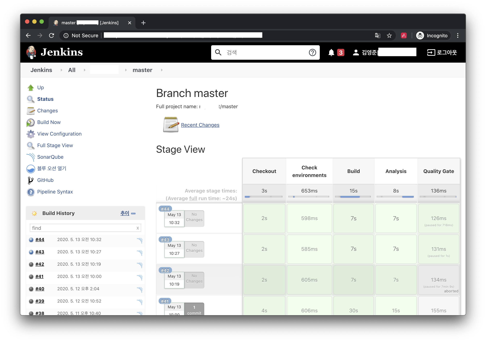
2. Jenkins 블루오션에서는 아래 화면과 같습니다.
    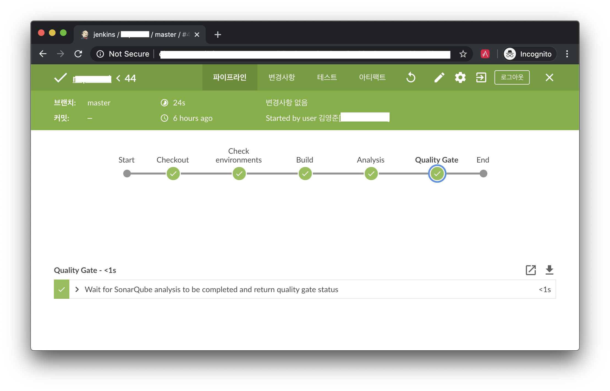
3. SonarQube에서 아래 화면과 같이 분석결과를 확인할 수 있습니다.
    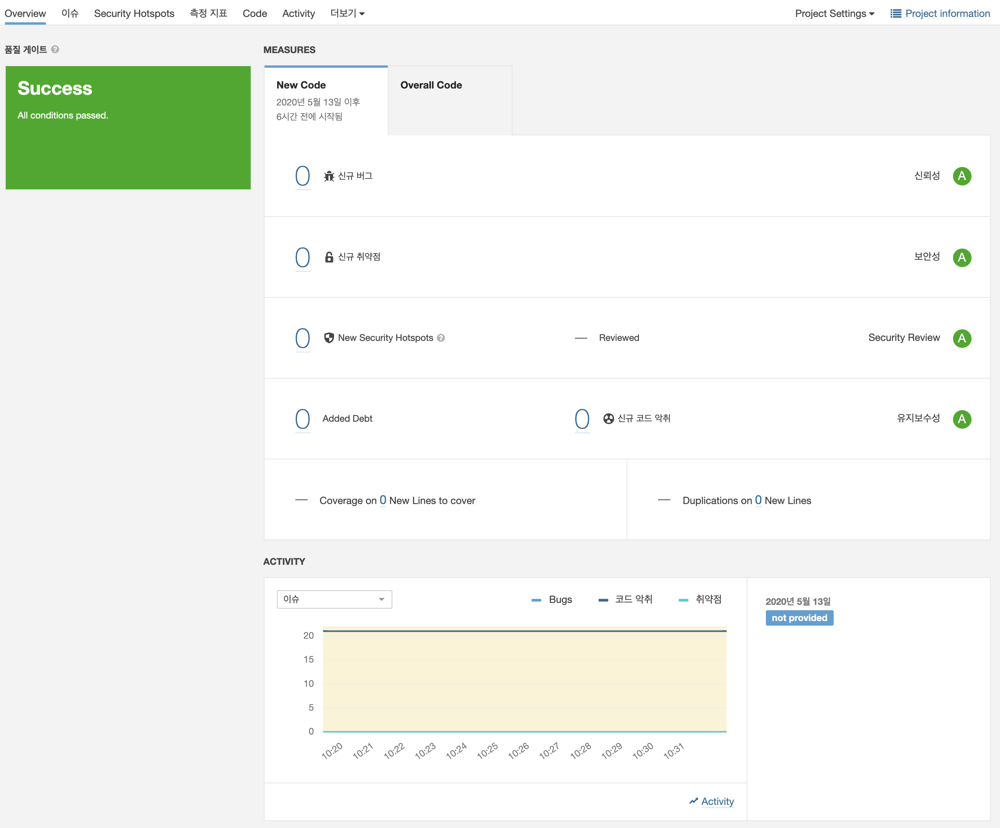

### Pull Request 분석 설정

Pull Request 분석의 경우에 몇 가지 설정이 더 필요합니다.

1. SonarQube 프로젝트 설정의 "Pull Request Decoration" 탭에서 GitHub의 repository를 추가합니다.
    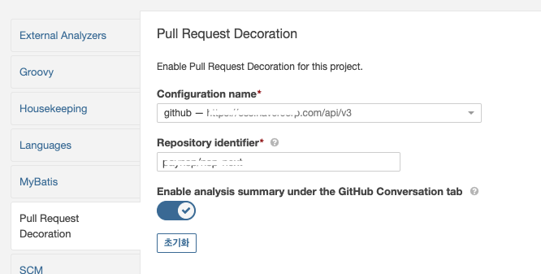
2. GitHub에 SonarQube github 앱을 설치합니다.
    - [Decorating Pull Requests](https://docs.sonarqube.org/latest/analysis/pr-decoration/) 참고


# References
- [SonarQube](https://www.sonarqube.org/)
- [SonarQube Documentation](https://docs.sonarqube.org/latest/)
- [Kotlin 도입 과정에서 만난 문제와 해결 방법](https://d2.naver.com/helloworld/6685007)