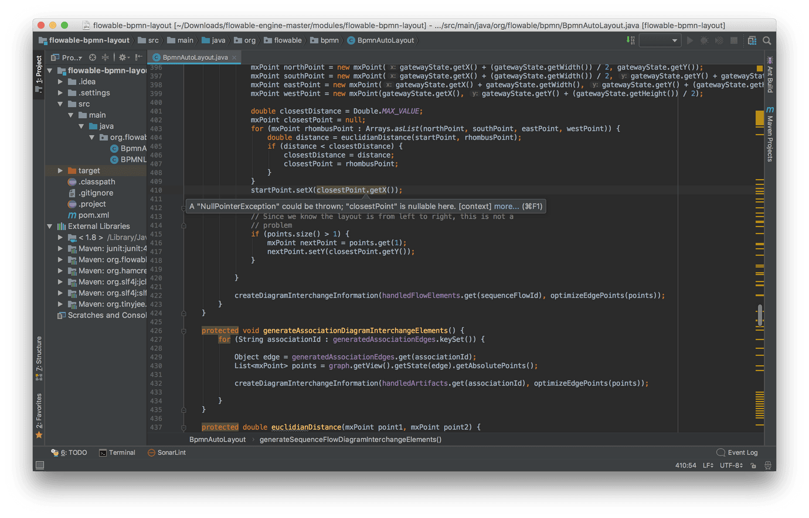
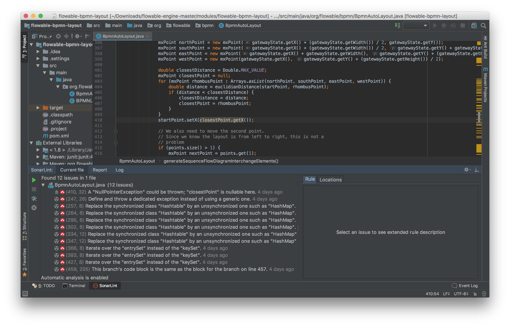
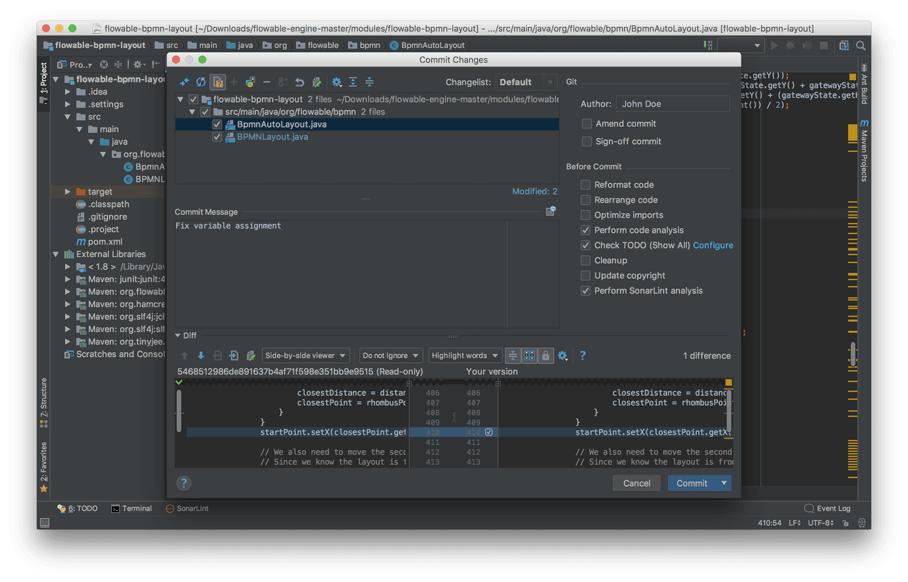
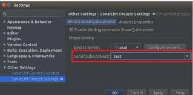
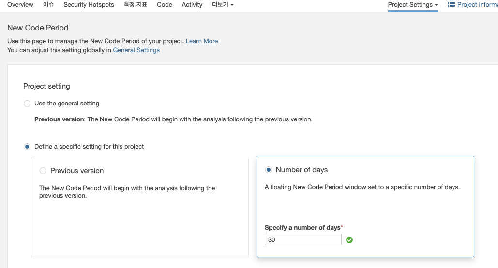
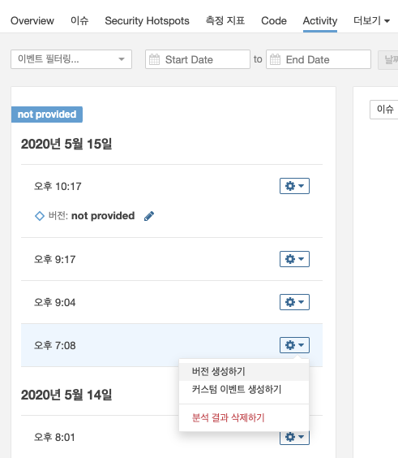
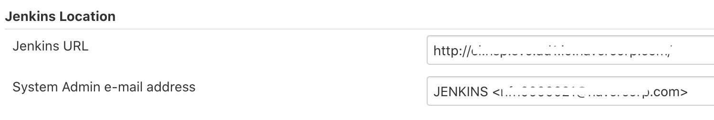
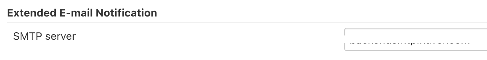

**목차**

1. [SonarQube - 소개](https://github.com/wicksome/TIL/blob/master/sonarqube/v1.md)
   > 간략한 소나큐브 및 Developer Edition 기능 소개
2. [SonarQube - 분석](https://github.com/wicksome/TIL/blob/master/sonarqube/v2.md)
   > 파이프라인으로 소나큐브 분석 방법
3. **SonarQube - 팁**
   > SonarLint 사용방법, SonarQube 활용, 다양한 Pipeline 설정 등

---

분석 파이프라인 또는 SonaQube를 통해 활용하거나 추가 사용 팁에 관하여 정리해보았습니다.

1. [IntellJ IDEA에서 SonarLint 활용하기](#1)
2. [SonarQube 분석 결과 전달 받기](#2)
3. [SonarQube 분석 버저닝하기](#3)
4. [Jenkinsfile 분석 실패 알람받기](#4)
   1. 메일로 전달받기 - [Email Extension](https://plugins.jenkins.io/email-ext/)
   2. Slack으로 전달받기 `TODO`
5. [정적분석 Jenkinsfile 예제](#5)

이 외에도 적용하시면서 겪었던 이슈나 다양한 팁 공유해주시면 감사하겠습니다

**참고 링크**

- [SonarSource Rules](https://rules.sonarsource.com/) - 분석 룰을 전체적으로 볼 수 있는 웹

<a name="1"></a>

# IntellJ IDEA에서 SonarLint 활용하기

[SonarLint](https://www.sonarlint.org/)는 코딩할 때 품질 이슈를 미리 감지하고 수정하는데 도움이 되는 IDE 플러그인입니다. Eclipse, IntelliJ IDEA, Visual Studio, VS Code IDE를 지원하며, 여기서는 IntlliJ IDEA 기준으로 공유드립니다.

현재(2020.05.15) InteliiJ IDEA용 SonarLint 플러그인에서는 Java, JS, TypeScript, Python, Kotlin, Ruby, HTML5, PHP 코드에 대해서 분석이 가능합니다. 또한 플러그인 설정을 통해 SoanrQube 서버의 프로파일과 동기화하여 분석이 가능합니다.

## 기능

> 클릭하시면 예시 화면을 볼 수 있습니다.

<details><summary>에디터에서 바로 이슈가 있는 코드가 확인 가능하고 해당 이슈를 강조해줍니다.</summary>
<p>



</p>
</details>

<details><summary>IDEA에서 현재 보고있는 코드를 분석하거나, 전체 코드를 분석하여 origin에 올리기전에 이슈를 확인할 수 있습니다.</summary>
<p>



</p>
</details>

<details><summary>commit하기 전에 작업한 코드를 분석받을 수 있습니다.</summary>
<p>



</p>
</details>

## 적용 방법

1. IntellJ IDEA에서 [SonarLint](https://plugins.jetbrains.com/plugin/7973-sonarlint) 플러그인 설치합니다.
2. "Preferences - SonarLint" 탭에서 SonarQube 서버를 등록합니다.
    
    - Connection Type은 "SonarQube"이고, URL에는 구축한 SonarQube URL을 입력합니다.
    - 인증방식은 Token이며, 아래와 같은 링크에서 발급받아 입력합니다.
        > https://{sonarqube-url}/account/security/
3. "Preferences - SonarLint - Project Settings"에서 SonarQube 프로젝트를 연결합니다.

   > 멀티-모듈 프로젝트로 개발하면서 maven, gradle 명령으로 각 모듈별로 정적 분석을 사용한다면 SonarLint에서 프로젝트 설정이 불가합니다.
   > PR 분석을 위해서라도 전체 분석하는 SonarQube 프로젝트를 등록하는 것을 권장합니다.

   

   - Connection은 이전에 등록한 서버를 설정합니다.
   - Project는 검색이 가능하며, 해당 프로젝트와 맞는 SonarQube 프로젝트를 지정합니다.

4. 위와 같은 설정을 마치면, 하단의 `SonarLint` 아이콘을 통해 분석결과를 확인할 수 있습니다.
   

<a name="2"></a>

# SonarQube 분석 결과 전달 받기

자신이 작성한 코드에 관한 분석 결과를 메일로 받아볼 수 있습니다. 메일은 계정설정에서 직접 설정하거나, GitHub를 통한 로그인일 경우 GitHub에 등록된 메일로 발송됩니다. '알림' 탭에서 전체 혹은 프로젝트별 설정하실 수 있습니다.

> https://{sonarqube-url}/account/notifications

- 본인이 등록한 프로젝트의 분석 실패 알람
- 나에게 할당된 이슈나 내가 보고한 이슈의 변경 내역
- 새로운 품질 게이트 상태
- 나의 신규 이슈

<a name="3"></a>

# SonarQube 분석 버저닝하기

정적분석시 버전을 지정하여 이전 버전보다 얼마나 코드 품질이 향상됬는지 확인할 수 있습니다. 버전을 지정하는 방법에는 Jenkins에서 직접 Parameter로 설정하거나 SonarQube UI를 통해 특정 기간별로 정하는 방법, 직접 분석된 결과에 설정하는 방법이 있습니다.

## Jenkinsfile

Pipeline에서 groovy 변수 할당을 통해 버전을 지정할 수 있습니다. 아래 코드는 `2020-05` 와 같이 월별로 버저닝을 하는 pipeline 예제입니다.

**Declarative Pipeline**

```groovy
pipeline {
    environment {
        SONAR_ANALYSIS_VERSION = new Date().format('yyyy-MM', TimeZone.getTimeZone('Asia/Seoul'))
    }
    stages {
        stage('Analysis') {
            steps {
                script {
                    sh """
                        ${SONAR_SCANNER_HOME}/bin/sonar-scanner \
                        -Dsonar.projectVersion=${SONAR_ANALYSIS_VERSION}
                        ...
                    """
                }
            }
        }
    }
}


```

**Scripted Pipeline**

```groovy
stage('Analysis') {
    def analysisVersion = new Date().format('yyyy-MM', TimeZone.getTimeZone('Asia/Seoul'))
    // ...
    sh """
        ${scannerHome}/bin/sonar-scanner \
        -Dsonar.projectKey=${projectKey} \
        -Dsonar.branch.name=${env.BRANCH_NAME} \
        -Dsonar.projectVersion=${analysisVersion} \
        // ....
    """
```

## SonarQube UI

"Project Settings - New Code Period" 화면에서 지정이 가능합니다. 기본적으로는 사용자가 지정한 파라미터로 버저닝을 하며, "Number of days"를 선택하면 지난일수를 구분으로 버전닝을 보여줍니다.



분석 파라미터를 사용하지 않는다면 SonarQube UI에서 직접 생성이 가능합니다. " Project - Activity" 탭을 보면 왼쪽에 분석이 일어난 시간별로 결과를 확인할 수 있으며, 각 분석 결과에서 "버전 생성하기"를 통해 버전 생성이 가능합니다. 이 방법은 관리하기가 어려우므로 가능하면 이 방법보단 자동화하는 것을 권장합니다.



<a name="4"></a>

# Jenkinsfile 분석 실패 알람받기

Multibranch Pipeline을 사용하면 기본적으로 분석 결과를 github commit status를 설정해줍니다. 여기서는 추가적으로 분석 결과를 좀 더 즉각적으로 확인 할 수 있는 방법에 대해서 공유합니다.

## 메일을 전달받기

Jenkins의 [Email Extension](https://plugins.jenkins.io/email-ext/) 플러그인을 통해 실패된 작업을 받아볼 수 있습니다. 메일은 사내망 접근이 불가능한 경우에 앱을 통해 자세한 빌드 내용을 확인 할 수 있습니다.

1. [Email Extension](https://plugins.jenkins.io/email-ext/) 플러그인 설치
2. Jenkins에서 메일 발신인 설정
    
3. Jenkins에서 메일 서버 설정
    
4. Jenkinsfile 설정

    **Declarative Pipeline**

    ```groovy
    pipeline {
        stages {
            // ....
        }
        post {
            failure {
                script {
                    def mailRecipients = 'id@email-host.com'
                    def jobName = currentBuild.fullDisplayName

                    emailext body: '''${SCRIPT, template="groovy-html.template"}''',
                        mimeType: 'text/html',
                        subject: "[정적분석] ${jobName} 빌드 실패",
                        to: "${mailRecipients}",
                        replyTo: "${mailRecipients}",
                        recipientProviders: [[$class: 'DevelopersRecipientProvider']]
                }
            }
        }
    }
    ```

    > Scripted Pipeline으로 작성하면 log 가져올 때 권한 이슈가 있습니다. 빌드 로그 확인이 필요하다면 Declarative Pipeline를 사용하시기 바랍니다.
    >
    > ```groovy
    > def logContent1 = Jenkins.getInstance()
    >     .getItemByFullName(env.JOB_NAME)
    >     .getBuildByNumber(
    >         Integer.parseInt(env.BUILD_NUMBER))
    >     .logFile.text
    > def logContent2 = currentBuild.rawBuild.getLog(100)
    > ```
    >
    > **References**
    >
    > - [Get a job’s console logfile from a Jenkins pipeline](https://fraaargh.wordpress.com/2018/06/20/get-a-jobs-console-logfile-from-a-jenkins-pipeline/)
    > - [How to embed html report in email body using Email-ext plugin?](https://support.cloudbees.com/hc/en-us/articles/226237768-How-to-embed-html-report-in-email-body-using-Email-ext-plugin-)
    > - [How to set current build result in Pipeline?](https://support.cloudbees.com/hc/en-us/articles/218554077-How-to-set-current-build-result-in-Pipeline-)

## 메신저(Slack)로 전달받기

> 작성중이므로 참고만 하시길 바랍니다.

여기서는 간략한 설명과 Jenkinsfile만 설명드립니다.

```groovy
post {
    failure {
        script {
            // Works notification
            // * https://plugins.jenkins.io/blueocean-display-url/
            // * https://opensource.triology.de/jenkins/pipeline-syntax/globals#currentBuild
            def worksRecipients = recipients.collect { "\"$it\"" }.join(',')
            def auth = '{HTTP Basic Auth Header}'
            def slackUrl = '{Slack URL}'
            def body = JsonOutput.prettyPrint(JsonOutput.toJson([
                accountIdList: recipients,
                content: [
                    type: 'link',
                    contentText: """
                        | [빌드 실패] ${env.JOB_NAME} ${env.BUILD_DISPLAY_NAME}
                        |
                        | * branch: ${env.GIT_BRANCH}
                        | * commit: ${env.GIT_COMMIT.take(7)}
                    """.stripMargin().stripIndent().trim(),
                    linkText: "${currentBuild.fullDisplayName}",
                    link: "${env.RUN_DISPLAY_URL}"
                ]
            ]))
            sh """
                curl -X POST '$slackUrl' \
                        -H 'Content-Type: application/json;charset=UTF-8' \
                        -H 'Authorization: $auth' \
                        --data '$body'
            """
        }
    }
}
```


<a name="5"></a>

# 정적분석 Jenkinsfile 예제

> 아래 Jenkinsfile은 결제형페이에서 사용하는 파이프라인의 예시입니다. 각 팀에 맞춰 커스터마이징이 필요합니다.

**features**

- Multibranch Pipeline 에서 작성되었습니다.
- 월(month)을 기준으로 분석 버저닝합니다. (`yyyy-MM`)
- 멀티-모듈 gradle 프로젝트에서 작성되었습니다.
  - `jacocoRootReport` task를 통합 jacoco 리포트를 aggregate 합니다.
- PR 분석과 브랜치 분석을 합니다.
- 품질게이트를 통과해야 빌드 파이프라인이 성공합니다.
- 빌드 실패시 메일등으로 알람을 받습니다.

**build.gradle.kts**

jacoco 플러그인 설정 및 멀티-모듈 구조에서 하위 프로젝트의 jacoco 리포트를 합쳐주는 태스크(`jacocoRootReport`)가 필요합니다. 이를 원하지 않는다면 `-Dsonar.coverage.jacoco.xmlReportPaths` 파라미터에 분석별 리포트파일은 콤마(`,`)를 구분자로 모두 추가하시면 됩니다.

```kt
plugins {
    jacoco
}

subprojects {
    apply {
        plugin("jacoco")
    }
    tasks {
        withType<Test> {
            enabled = true
            useJUnitPlatform()
            finalizeBy("jacocoTestReport")
        }

        // withType<JacocoReport> {
        jacocoTestReport {
            dependsOn(project.tasks.withType<Test>())
            report {
                xml.isEnabled = true
            }
        }
    }
    jacoco {
        toolVersion = "0.8.5"
    }
}

// Jacoco reports aggregation
task<JacocoReport>("jacocoRootReport") {
    dependsOn(subprojects.map { it.tasks.withType<Test>() })
    dependsOn(subprojects.map { it.tasks.withType<JacocoReport>() })
    additionalSourceDirs.setFrom(subprojects.map { it.the<SourceSetContainer>()["main"].allSource.srcDirs })
    sourceDirectories.setFrom(subprojects.map { it.the<SourceSetContainer>()["main"].allSource.srcDirs })
    classDirectories.setFrom(subprojects.map { it.the<SourceSetContainer>()["main"].output })
    executionData.setFrom(project.fileTree(".") {
        include("**/build/jacoco/test.exec")
    })
    reports {
        xml.isEnabled = true
        csv.isEnabled = false
        html.isEnabled = false
    }
}
```

**Jenkinsfile**

```groovy
import groovy.json.JsonOutput


pipeline {
    agent any
    environment {
        SONAR_SCANNER_HOME = tool 'sonar-scanner';
        SONAR_PROJECT_KEY = '{your project key}'
        SONAR_ANALYSIS_VERSION = new Date().format('yyyy-MM', TimeZone.getTimeZone('Asia/Seoul'))

        REPO_URL = '{your repository url}'
    }
    tools {
        jdk 'openjdk11'
    }
    stages {
        stage('Check environments') {
            steps {
                sh 'printenv|sort'
                sh '''
                    java -version
                    date +"%Z %z"
                '''
            }
        }
        stage('Build') {
            steps {
                sh './gradlew clean build -x test'
            }
        }
        stage('Tests') {
            steps {
                sh './gradlew test jacocoRootReport'
            }
            // Jenkins에서도 plugin을 통해 확인하고자 할 경우 추가
            post {
                success {
                    junit '**/build/test-results/**/TEST-*.xml'
                    step([
                        $class       : 'JacocoPublisher',
                        execPattern  : 'modules/**/build/jacoco/*.exec',
                        classPattern : 'modules/**/build/classes',
                        sourcePattern: 'modules/**/src/main/kotlin'
                    ])
                }
            }
        }
        stage('Analysis') {
            steps {
                withSonarQubeEnv("sonarqube-server") {
                    script {
                        if (env.CHANGE_ID) {
                            // Pull Request
                            sh """
                                ${SONAR_SCANNER_HOME}/bin/sonar-scanner \
                                -Dsonar.projectKey=${SONAR_PROJECT_KEY} \
                                -Dsonar.pullrequest.key=${env.CHANGE_ID} \
                                -Dsonar.pullrequest.branch=${env.CHANGE_BRANCH} \
                                -Dsonar.pullrequest.base=${env.CHANGE_TARGET} \
                                -Dsonar.sources=. \
                                -Dsonar.inclusions=**/src/main/** \
                                -Dsonar.tests=. \
                                -Dsonar.test.inclusions=**/src/test/** \
                                -Dsonar.sourceEncoding=UTF-8 \
                                -Dsonar.junit.reportPaths=**/build/test-results \
                                -Dsonar.coverage.jacoco.xmlReportPaths=build/reports/jacoco/jacocoRootReport/jacocoRootReport.xml \
                                -Dsonar.links.homepage=${REPO_URL} \
                                -Dsonar.links.ci=${env.JENKINS_URL} \
                                -Dsonar.links.issue=${REPO_URL}/issues \
                                -Dsonar.links.scm=${REPO_URL} \
                                --debug
                            """
                        } else {
                            sh """
                                ${SONAR_SCANNER_HOME}/bin/sonar-scanner \
                                -Dsonar.projectKey=${SONAR_PROJECT_KEY} \
                                -Dsonar.branch.name=${env.BRANCH_NAME} \
                                -Dsonar.projectVersion=${SONAR_ANALYSIS_VERSION} \
                                -Dsonar.sources=. \
                                -Dsonar.inclusions=**/src/main/** \
                                -Dsonar.tests=. \
                                -Dsonar.test.inclusions=**/src/test/** \
                                -Dsonar.sourceEncoding=UTF-8 \
                                -Dsonar.junit.reportPaths=**/build/test-results \
                                -Dsonar.coverage.jacoco.xmlReportPaths=build/reports/jacoco/jacocoRootReport/jacocoRootReport.xml \
                                -Dsonar.links.homepage=${REPO_URL} \
                                -Dsonar.links.ci=${env.JENKINS_URL} \
                                -Dsonar.links.issue=${REPO_URL}/issues \
                                -Dsonar.links.scm=${REPO_URL} \
                                --debug
                            """
                        }
                    }
                }
            }
        }
        stage("Quality Gate") {
            steps {
                timeout(time: 1, unit: 'HOURS') {
                    waitForQualityGate abortPipeline: true
                }
            }
        }
    }
    post {
        failure {
            script {
                def recipients = ['opid911@gmail.com']

                // mail notification
                def mailRecipients = recipients.join(',')
                emailext body: '''${SCRIPT, template="groovy-html.template"}''',
                    mimeType: 'text/html',
                    subject: "[정적분석] ${currentBuild.fullDisplayName} 빌드 실패",
                    to: "${mailRecipients}",
                    replyTo: "${mailRecipients}",
                    recipientProviders: [[$class: 'DevelopersRecipientProvider']]

                // TODO: Slack notification
                // * https://plugins.jenkins.io/blueocean-display-url/
                // * https://opensource.triology.de/jenkins/pipeline-syntax/globals#currentBuild
                def worksRecipients = recipients.collect { "\"$it\"" }.join(',')
                def auth = '{HTTP Basic Auth Header}'
                def slackUrl = '{slcak URL}'
                def body = JsonOutput.prettyPrint(JsonOutput.toJson([
                    accountIdList: recipients,
                    content: [
                        type: 'link',
                        contentText: """
                            | [빌드 실패] ${env.JOB_NAME} ${env.BUILD_DISPLAY_NAME}
                            |
                            | * branch: ${env.GIT_BRANCH}
                            | * commit: ${env.GIT_COMMIT.take(7)}
                        """.stripMargin().stripIndent().trim(),
                        linkText: "${currentBuild.fullDisplayName}",
                        link: "${env.RUN_DISPLAY_URL}"
                    ]
                ]))
                sh """
                    curl -X POST '$slackUrl' \
                         -H 'Content-Type: application/json;charset=UTF-8' \
                         -H 'Authorization: $auth' \
                         --data '$body'
                """
            }
        }
    }
}


```

> 아래는 이전에 작성했던 maven을 통해 빌드했던 Jenkinsfile 예제입니다. 다양한 설정을 할 경우에 도움이 되고자 추가하였습니다.

<details><summary>[maven] 멀티모듈 프로젝트에서 특정 모듈 분석하기 -Declarative Pipeline</summary>
<p>

```groovy
pipeline {
  agent { label 'jenkins' }
  environment {
    BRANCH = 'develop'
    COMPONENT = 'proj-admin'
    BASE_PACKAGE = 'admin'
    SONAR_SCANNER_HOME = tool 'sonar-scanner'
    SONAR_PROJECT_KEY = 'proj:admin'
    SONAR_ANALYSIS_VERSION = new Date().format('yyyy-MM', TimeZone.getTimeZone('Asia/Seoul'))
  }

  tools {
    maven '3.6.1'
  }

  stages {
    stage('Check environments') {
      steps {
        sh 'printenv|sort'
        sh '''
          java -version
          date +"%Z %z"
        '''
      }
    }

    stage('Checkout') {
      steps {
        git branch: BRANCH,
            credentialsId: 'github_rsa',
            url: 'git@github.com:wicksome/proj.git'
      }
    }

    stage('Tests') {
      steps {
        sh '''
          mvn clean \
              org.jacoco:jacoco-maven-plugin:prepare-agent \
              compile \
              test \
              org.jacoco:jacoco-maven-plugin:report \
              -pl ${COMPONENT} \
              -am \
              -DfailIfNoTests=false \
              -Dtest=me/wickso/proj/${BASE_PACKAGE}/**/*,!**/*ClientTest.java \
              -Duser.timezone=Asia/Seoul
        '''
      }
      post {
        success {
          junit '**/target/surefire-reports/*.xml'
          step([
            $class: 'JacocoPublisher',
            execPattern: COMPONENT + '/target/jacoco.exec',
            classPattern: COMPONENT + '/target/classes',
            sourcePattern: '**/src/main/java'
          ])
        }
      }
    }

    stage('Analysis') {
      steps {
        withSonarQubeEnv('sonarqube-server') {
          // https://docs.sonarqube.org/latest/analysis/analysis-parameters/
          sh '''
            ${SONAR_SCANNER_HOME}/bin/sonar-scanner \
            -Dsonar.host.url=http://{sonarqube-url}.com \
            -Dsonar.projectKey=${SONAR_PROJECT_KEY} \
            -Dsonar.projectVersion=${SONAR_ANALYSIS_VERSION} \
            -Dsonar.branch.name=${BRANCH} \
            -Dsonar.sources=${COMPONENT}/pom.xml,${COMPONENT}/src/main \
            -Dsonar.sourceEncoding=UTF-8 \
            -Dsonar.java.source=1.8 \
            -Dsonar.java.binaries=${COMPONENT}/target/classes \
            -Dsonar.java.libraries=$HOME/.m2/**/*.jar \
            -Dsonar.tests=${COMPONENT}/src/test \
            -Dsonar.junit.reportPaths=${COMPONENT}/target/surefire-reports \
            -Dsonar.coverage.jacoco.xmlReportPaths=${COMPONENT}/target/site/jacoco/jacoco.xml \
            -Dsonar.links.homepage=https://github.com/wicksome/proj \
            -Dsonar.links.scm=https://github.com/wicksome/proj \
            -Dsonar.github.repository=proj/admin \
            -X
          '''
        }
      }
    }
  }
  post {
    failure {
      script {
        def mailRecipients = 'opid911@gmail.com'
        def jobName = currentBuild.fullDisplayName

        emailext body: '''${SCRIPT, template="groovy-html.template"}''',
          mimeType: 'text/html',
          subject: "[정적분석] ${jobName} 빌드 실패",
          to: "${mailRecipients}",
          replyTo: "${mailRecipients}",
          recipientProviders: [[$class: 'DevelopersRecipientProvider']]
      }
    }
  }
}
```

</p>
</details>

<details><summary>[maven] Pull Request 분석 - Declarative Pipeline</summary>
<p>

```groovy
void setBuildStatus(String message, String state, String context, String sha1) {
  step([
    $class             : "GitHubCommitStatusSetter",
    reposSource        : [$class: "ManuallyEnteredRepositorySource", url: "https://github.com/wicksoem/proj"],
    contextSource      : [$class: "ManuallyEnteredCommitContextSource", context: context],
    errorHandlers      : [[$class: "ChangingBuildStatusErrorHandler", result: "UNSTABLE"]],
    commitShaSource    : [$class: 'ManuallyEnteredShaSource', sha: sha1],
    statusBackrefSource: [$class: "ManuallyEnteredBackrefSource", backref: "${env.RUN_DISPLAY_URL}"],
    statusResultSource : [$class: "ConditionalStatusResultSource", results: [[$class: "AnyBuildResult", message: message, state: state]]]
  ]);
}

pipeline {
  agent { label 'jenkins' }
  environment {
    SONAR_SCANNER_HOME = tool 'sonar-scanner'
    SONAR_PROJECT_KEY = 'wicksome:proj'
  }

  tools {
    maven '3.6.1'
  }

  stages {
    stage('Checkout') {
      steps {
        setBuildStatus("Analysis started...", "PENDING", "CI: Analysis", ghprbActualCommit);
        git branch: GIT_BRANCH,
          credentialsId: 'rsa',
          url: 'git@github.com:wicksome/proj.git'
      }
    }

    stage('Tests') {
      steps {
        setBuildStatus("Run testing...", "PENDING", "CI: Analysis", ghprbActualCommit);
        sh '''
          mvn clean \
          org.jacoco:jacoco-maven-plugin:prepare-agent \
          test \
          org.jacoco:jacoco-maven-plugin:report \
          -f pom.xml \
          -Denv=test \
          -Dtest=me/wickso/proj/**/*,!**/*ClientTest.java, \
          -Duser.timezone=Asia/Seoul
        '''
      }
      post {
        success {
          setBuildStatus("Reporting results...", "PENDING", "CI: Analysis", ghprbActualCommit);
          junit '**/target/surefire-reports/TEST-*.xml'
          step([
            $class       : 'JacocoPublisher',
            execPattern  : '**/target/jacoco.exec',
            classPattern : '**/target/classes',
            sourcePattern: '**/src/main/java'
          ])
        }
      }
    }

    stage('Analysis') {
      steps {
        setBuildStatus("Run analysis...", "PENDING", "CI: Analysis", ghprbActualCommit);
        withSonarQubeEnv('sonarqube-server') {
          sh '''
            ${SONAR_SCANNER_HOME}/bin/sonar-scanner \
            -Dsonar.pullrequest.key=$ghprbPullId \
            -Dsonar.pullrequest.branch=$ghprbSourceBranch \
            -Dsonar.pullrequest.base=$ghprbTargetBranch \
            -Dsonar.projectKey=${SONAR_PROJECT_KEY} \
            -Dsonar.host.url=http://{sonarqube-url}.com \
            -Dsonar.sources=pom.xml,admin/src/main,web/src/main,api/src/main,batch/src/main \
            -Dsonar.sourceEncoding=UTF-8 \
            -Dsonar.exclusions=core/src/**/legacy/** \
            -Dsonar.java.source=1.8 \
            -Dsonar.java.binaries=**/target/classes \
            -Dsonar.java.libraries=$HOME/.m2/**/*.jar \
            -Dsonar.tests=core/src/test,admin/src/test,api/src/test,batch/src/test \
            -Dsonar.junit.reportPaths=**/target/surefire-reports \
            -Dsonar.coverage.jacoco.xmlReportPaths=core/target/site/jacoco/jacoco.xml,admin/target/site/jacoco/jacoco.xml,api/target/site/jacoco/jacoco.xml,batch/target/site/jacoco/jacoco.xml \
            -Dsonar.links.homepage=https://github.com/wicksome/proj \
            -Dsonar.links.scm=https://github.com/wicksome/proj \
            -Dsonar.github.repository=wicksome/proj
          '''
        }
      }
    }
  }

  post {
    success {
      setBuildStatus("Analysis succeeded.", "SUCCESS", "CI: Analysis", ghprbActualCommit);
    }
    failure {
      setBuildStatus("Analysis failed.", "FAILURE", "CI: Analysis", ghprbActualCommit);
    }
  }
}
```

</p>
</details>