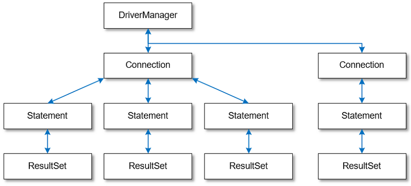

= spring-data-jdbc
:toc:
:source-highlighter: highlight.js

++++

  
   (▲ https://hackmd.io/@ddubson/rkn-sR4wU)

++++

== JDBC

* Java Database Connectivity(https://www.oracle.com/java/technologies/javase/javase-tech-database.html[JDBC])는 DBMS에 접근하기 위한 Java의 표준 API 스펙
* JDBC 드라이버 로딩, DBMS 연결, SQL 전송 및 결과 반환 등의 처리

=== References

* https://godekdls.github.io/Spring%20Data%20Access/dataaccesswithjdbc/[Spring Data Access - Data Access with JDBC]
* https://github.com/benelog/spring-jdbc-tips/blob/master/spring-jdbc-core.md[Spring JDBC의 핵심 사용법]

[source, kotlin]
.Example
----
fun main() {
	val driver = "com.mysql.cj.jdbc.Driver"
	val url = "jdbc:mytsql://localhost:3306/test"

	Class.forName(driver).newInstance()
	val con: Connection = DriverManager.getConnection(url, "root", "root")
	val st: Statement = con.createStatement()

	val sql = "SELECT * FROM member"
	val rs: ResultSet = st.executeQuery(sql)

	while(rs.next()) {
		const name = rs.getString(1)
		const date = rs.getString(2)

		println("$name - $date")
	}

	rs.close()
	st.close()
	con.close()
}
----

=== 구성요소

==== Driver

[source, kotlin]
----
java.sql.Driver
----

* `Driver` 인터페이스를 구현하여 DB와 연결할 JDBC Driver를 만들 수 있음
* https://mvnrepository.com/artifact/com.mysql/mysql-connector-j[com.mysql:mysql-connector-j]와 같은 라이브러리가 해당 DBMS에 맞는 드라이버를 구현함

==== Connection

[source, kotlin]
----
import java.sql.Driver
import java.sql.Connection

val con: Connection = if (usingDriverManager) {
    // 방법 1 - DriverManager
    val driver = "com.mysql.cj.jdbc.Driver"
    Class.forName(driver).getDeclaredConstructor().newInstance()
    DriverManager.getConnection(url, user, password)
} else {
     // 방법 2 - MysqlDataSource
    MysqlDataSource().apply {
        setUrl(url)
        setUser(user)
        setPassword(password)
    }.connection
}
----
** 특정 DB와의 연결정보를 가지는 인터페이스
** `DriverManager.getConnection()` 를 통해 JDBC 연결 생성
** 특정 database와 jdbc driver에 의존함
** 연결이 되면 `Stagement` 를 통해 쿼리는 실행할 수 있음

==== Statement

[source, kotlin]
----
import java.sql.Statement

val st: Statement = con.createStatement()
----

* SQL Query를 DB에 전송하는 방법을 정의한 인터페이스
* `Connection` 을 통해 가져옴

===== PreparedStatement

[source, kotlin]
----
import java.sql.PreparedStatement
----

* `Statement` 의 하위 인터페이스
* SQL을 미리 컴파일하여 실행 속도를 높힘

==== ResultSet

[source, kotlin]
----
import java.sql.ResultSet
----

* `Statement`를 통한 쿼리 실행 결과에 사용되는 인터페이스

=== 동작 분석

==== 어떻게 데이터를 `ResultSet` 에 가져오는가?

* mysql testcontainer 사용한 test case에서 디버깅해봤을 때
** `ResultSet` 의 구현체는 `com.mysql.cj.jdbc.result.ResultSetImpl` 사용함
** 쿼리 실행시 `rowData: ResultsetRows` (실제 인스턴스는 `ResultsetRowsStatic`)필드의 `rows` 에 `Row` 인스턴가 저장되어 있음
`Row` 인스턴스는 `ByteArrayRow` 이고, `internalRowData` 가 byte-array를 가지고 있음
+
image:jdbc-debug.png[]
** DB와 무언가를 통한 통신을 통해 데이터를 byte array로 가져와서 저장하는 것으로 보임.
*** TODO: cursor는 그럼 어떻게 동작할까?
+
[source, kotlin]
----
// MySQL에서 이 설정이 있다면 스트리밍 방식으로 읽는 듯
// https://dev.mysql.com/doc/connector-j/8.0/en/connector-j-reference-implementation-notes.html
val stmt = con.createStatement(
    java.sql.ResultSet.TYPE_FORWARD_ONLY,
    java.sql.ResultSet.CONCUR_READ_ONLY,
).apply {
    fetchSize = Integer.MIN_VALUE
}
----

==== ConnectionPool

* 일정량의 Connection 인스턴스를 미리 만들어서 pool에 저장해두고 사용하기 위함
* HikariCP
** DBCP(Database Connection Pool) 라이브러리
+
[source, kotlin]
----
val config = HikariConfig().apply {
    jdbcUrl = url
    username = user
    this.password = password
}
val ds = HikariDataSource(config)
val con: Connection = ds.connection
----

=== 참고 링크

* https://blog.benelog.net/1898928.html

== spring-jdbc

[subs="quotes"]
----
*org.springframework.boot:spring-jdbc:5.2.9.RELEASE*
> org.springframework:spring-beans:5.2.9.RELEASE
> org.springframework:spring-core:5.2.9.RELEASE
> org.springframework:spring-tx:5.2.9.RELEASE
----

* https://docs.spring.io/spring-framework/docs/current/reference/html/data-access.html#jdbc[spring-jdbc]
* JDBC에서 처리하는 데이터베이스 관련 작업들을 스프링 프레임워크로 위임하고, 별도 API를 통해 데이터베이스 연결 및 쿼리 실행을 함.
* `DataSource` 를 생성하고 `JdbcTemplate` 에 주입하여 사용.
* `JdbcTemplate` 를 통해 JDBC를 편리하게 사용할 수 있음.
* `JdbcTemplate`: 가장 저수준에서 동작하며, Spring 내부적으로 `JdbcTemplate` 을 사용함
** thread-safe 하므로, DAO등에서 맴버 변수로 저장. `DataSource` 만 외부에서 유입받아 초기화해둘 수 있음.
** `NamedParameterJdbcTemplate`: `JdbcTemplate` 을 래핑해서 `?` 가 아닌 이름이 붙은 파라미터 사용할 수 있게함.

[plantuml]
....
@startuml

interface JdbcOperation {
  query(psc, rowMapper): List<T>
}
class JdbcTemplate

interface NamedParameterJdbcOperations
class NamedParameterJdbcTemplate {
  -classicJdbcTemplate: JdbcOperations
}

JdbcOperation <|-- JdbcTemplate
NamedParameterJdbcOperations <|-- NamedParameterJdbcTemplate

NamedParameterJdbcTemplate --> JdbcOperation

@enduml
....

=== 구성요소

==== RowMapper

* `RowMapper`: `ResultSet`(쿼리 결과)에서 원하는 객체로 타입을 변환하는 역할
* BeanPropertyRowMapper
** `DataClassRowMapper`

=== 참고 링크

* https://github.com/benelog/spring-jdbc-tips/blob/master/spring-jdbc-core.md

== spring-boot-starter-jdbc

[subs="quotes"]
----
*org.springframework.boot:spring-boot-starter-jdbc:2.3.4.RELEASE*
> com.zaxxer:HikariCP:3.4.5
> org.springframework.boot:spring-boot-starter:2.3.4.RELEASE
> org.springframework:spring-jdbc:5.2.9.RELEASE
----

* spring-jdbc에 대하여 스프링부트 의존성 관리를 한번에 하고자 wrapping된 모듈.

== ORM

* ORM^Object{sp}Relational{sp}Mapping^
* TODO

== spring-data-jdbc

[subs="quotes"]
----
*org.springframwork.data:spring-data-jdbc:2.0.4.RELEASE*
> org.slf4j-api:1.7.30
> org.springframework.data:spring-data-commons:2.3.4.RELEASE
> org.springframework.data:spring-data-relational:2.0.4.RELEASE
> org.springframework:spring-beans:5.2.9.RELEASE
> org.springframework:spring-context:5.2.9.RELEASE
> org.springframework:spring-core:5.2.9.RELEASE
> org.springframework:spring-jdbc:5.2.9.RELEASE
> org.springframework:spring-tx:5.2.9.RELEASE
----

* https://spring.io/projects/spring-data[Spring Data]의 미션은 데이터 액세스를 위해 친숙하고 일관된 Spring 기반의 프로그래밍 모델을 제공하는 동시에 기본 데이터 저장소의 특수한 특성을 유지하는 것.
* https://spring.io/projects/spring-data-jdbc[Spring Data JDBC]는 Spring Data의 여러 모듈중 하나로, 말 그대로 JDBC를 지원하는 모듈.
* `CrudRepository` 를 활용하여 기본적인 CRUD 구현을 쉽게 함.

== spring-boot-starter-data-jdbc

[subs="quotes"]
----
*org.springframework.boot:spring-boot-starter-data-jdbc:2.3.4.RELEASE*
> org.springframework.boot:spring-boot-starter-jdbc:2.3.4.RELEASE
> org.springframework.data:spring-data-jdbc:2.0.4.RELEASE
----

== spring-jdbc-plus

* https://github.com/naver[네이버]에서 제공하는 Spring Data JDBC 확장 라이브러리.

== References

* https://skyblue300a.tistory.com/7
* https://brunch.co.kr/@springboot/107

---

* JdbcTemplate:
* JdbcOperation: 구현체
* NamedParameterJdbcTemplate
* TransactionManager
* TransactionTemplate
* DataAccessStrategy
- https://github.com/wicksome/TIL/blob/main/spring-framework/jdbc.adoc

== findById

. `CrudRepository` 구현체인 `SimpleJdbcRepository`
.. `JdbcAggregateOperations` 필드의 `findById` 메서드 실행됨
.. `JdbcAggregateOperations` 구현체인 `JdbcAggregateTemplate`
... `DataAccessStrategy` 필드의 `findById` 메서드 호출
.... `DataAccessStrategy` 구현체인 `DefaultDataAccessStrategy`
.... **`SqlGeneratorSource` 필드의 `getSqlGenerator` 메서드 통해서 쿼리 생성**
.... `SqlParamgersFactory` 필드의 `forQueryById` 메서드 통해서 쿼리 파라미터 생성
.... `getEntityRowMapper` 메서드 통해 `RowMapper` 생성
.... `operations: NamedParameterJdbcOperations` 필드의 `queryForObject` 메서드 통해서 쿼리 실행 (w/ rowMapper)
..... `converter: JdbcConverter` 필드의 `query` 메서드 호출
..... `execute` 메서드 호출
..... `DateSourceUtils.getConnection(DataSource)` 메서드 통해서 `Connection` 생성
..... `doInPreparedStatement` 실행
...... `PreparedStatement#executeQuery` 메서드 통해서 `ResultSet` 생성
....... `update`
....... `AbstractQueryProtocol#executeQuery`
....... `ComQuery.sendSubCmd`
..... **쿼리 결과인 `result` 생성**
... `triggerAfterConvert` 메서드 실행

---

* 실제 DB로부터 어떻게 값이 오는지?
* reading converter가 동작할 수 있는지?
* spring batch에서 cursor는 어떻게?