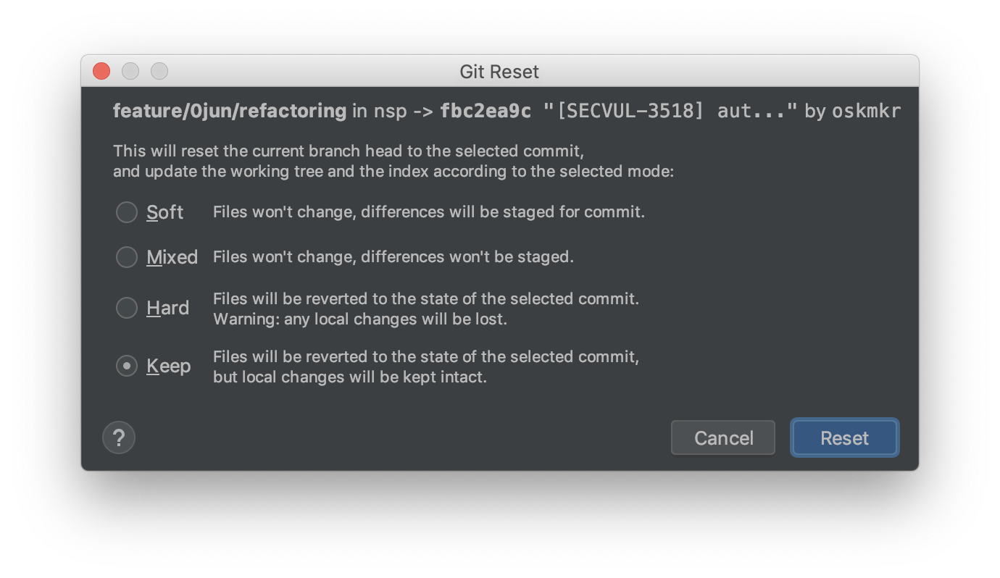

```bash
$ git reset -h
--mixed               reset HEAD and index
--soft                reset only HEAD
--hard                reset HEAD, index and working tree
--merge               reset HEAD, index and working tree
--keep                reset HEAD but keep local changes
```

**Soft** 

- Files won't change, differences will be staged for commit.
- 돌아가려는 커밋으로 이동하고, 이후의 내용은 stage 영역에 남겨둔다(add한 상태).

**Mixed (default)**

- Files won't change, differences won't be stage.
- 돌아가려는 커밋으로 이동하고, 이후의 변경내역은 add를 하기위한 영역에 남겨둔다(커밋하고자 하는 작업을 다시 add 해주어야 한다).

**Hard** 

- Files will be reverted to the state of the selected commit. Warning: any local changes will be lost.
- 돌아가려는 커밋으로 이동하고, 이후의 내용은 모두 삭제한다.

**Keep**

- Files will be reverted to the state of the selected commit, but local changes will be kept intact.
- 돌아가려는 커밋으로 이동하고, 이후의 내용은 모두 삭제된다. 하지만 로컬에서 작업하던 파일은 그대로 둔다.
